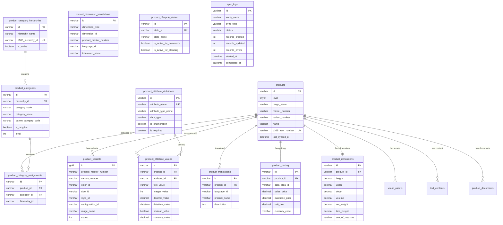
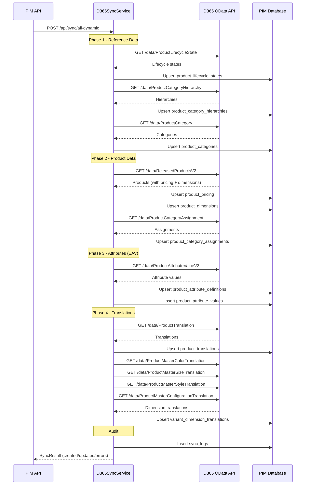
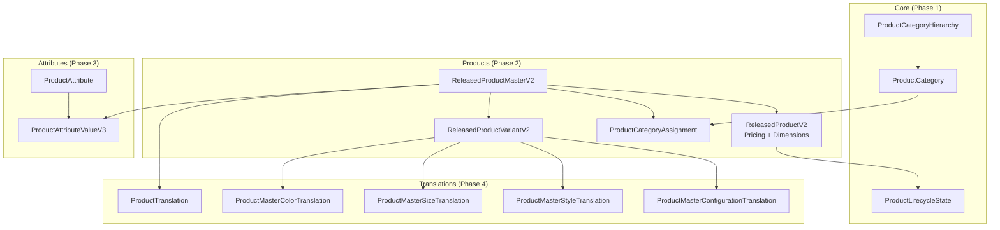

# D365 Dynamic Entity Relationship Diagram

## Tổng quan kiến trúc Sync D365 → PIM

```mermaid
flowchart TB
    subgraph D365["Microsoft Dynamics 365 F&O"]
        D365_RPV2[ReleasedProductV2]
        D365_RPM[ReleasedProductMasterV2]
        D365_RPVar[ReleasedProductVariantV2]
        D365_PCH[ProductCategoryHierarchy]
        D365_PC[ProductCategory]
        D365_PCA[ProductCategoryAssignment]
        D365_PA[ProductAttribute]
        D365_PAV[ProductAttributeValueV3]
        D365_PT[ProductTranslation]
        D365_DT_Color[ProductMasterColorTranslation]
        D365_DT_Size[ProductMasterSizeTranslation]
        D365_DT_Style[ProductMasterStyleTranslation]
        D365_DT_Config[ProductMasterConfigurationTranslation]
        D365_PLS[ProductLifecycleState]
        D365_SPT[SalesPriceTrade]
        D365_PPT[PurchasePriceTrade]
    end

    subgraph PIM["PIM Database"]
        products
        product_variants
        product_category_hierarchies
        product_categories
        product_category_assignments
        product_attribute_definitions
        product_attribute_values
        product_translations
        variant_dimension_translations
        product_pricing
        product_dimensions
        product_lifecycle_states
        sync_logs
    end

    D365_RPM -->|sync| products
    D365_RPV2 -->|pricing + dimensions| products
    D365_RPVar -->|sync| product_variants
    D365_PCH -->|sync| product_category_hierarchies
    D365_PC -->|sync| product_categories
    D365_PCA -->|sync| product_category_assignments
    D365_PA -->|sync| product_attribute_definitions
    D365_PAV -->|sync| product_attribute_values
    D365_PT -->|sync| product_translations
    D365_DT_Color -->|sync| variant_dimension_translations
    D365_DT_Size -->|sync| variant_dimension_translations
    D365_DT_Style -->|sync| variant_dimension_translations
    D365_DT_Config -->|sync| variant_dimension_translations
    D365_PLS -->|sync| product_lifecycle_states
    D365_RPV2 -->|sync| product_pricing
    D365_RPV2 -->|sync| product_dimensions
```

## Entity Relationship Diagram (PIM Database)

## Sync Flow Sequence

## D365 Entity Dependency Graph

## Bảng tóm tắt D365 Entities

| # | D365 Entity | OData Endpoint | PIM Table | Sync Direction | Priority | API Status |
|---|-------------|----------------|-----------|----------------|----------|------------|
| 1 | `ProductLifecycleState` | `ProductLifecycleStates` | `product_lifecycle_states` | D365 → PIM | P0 | ⚠️ EMPTY (no data in UAT) |
| 2 | `ProductCategoryHierarchy` | `ProductCategoryHierarchies` | `product_category_hierarchies` | D365 → PIM | P0 | ✅ OK |
| 3 | `ProductCategory` | `ProductCategories` | `product_categories` | D365 → PIM | P0 | ✅ OK |
| 4 | `ProductCategoryAssignment` | `ProductCategoryAssignments` | `product_category_assignments` | D365 → PIM | P0 | ✅ OK |
| 5 | `ReleasedProductV2` (pricing) | `ReleasedProductsV2` | `product_pricing` | D365 → PIM | P0 | ✅ OK |
| 6 | `ReleasedProductV2` (dimensions) | `ReleasedProductsV2` | `product_dimensions` | D365 → PIM | P0 | ✅ OK |
| 7 | `ProductAttribute` | `ProductAttributes` | `product_attribute_definitions` | D365 → PIM | P0 | ✅ OK |
| 8 | `ProductAttributeValueV3` | `ProductAttributeValues` | `product_attribute_values` | D365 → PIM | P0 | ✅ OK |
| 9 | `ProductTranslation` | `ProductTranslations` | `product_translations` | D365 → PIM | P1 | ✅ OK |
| 10 | `ProductMasterColorTranslation` | `ProductMasterColorTranslations` | `variant_dimension_translations` | D365 → PIM | P1 | ⚠️ EMPTY (no data in UAT) |
| 11 | `ProductMasterSizeTranslation` | `ProductMasterSizeTranslations` | `variant_dimension_translations` | D365 → PIM | P1 | ⚠️ EMPTY (no data in UAT) |
| 12 | `ProductMasterStyleTranslation` | `ProductMasterStyleTranslations` | `variant_dimension_translations` | D365 → PIM | P1 | ⚠️ EMPTY (no data in UAT) |
| 13 | `ProductMasterConfigurationTranslation` | `ProductMasterConfigurationTranslations` | `variant_dimension_translations` | D365 → PIM | P1 | ✅ OK |

> **API Test Result (2026-05-19):** 10/14 entities trả về data, 4 entities accessible nhưng chưa có data trong môi trường UAT. Tất cả endpoints đều hoạt động, không có lỗi authentication hay permission.
