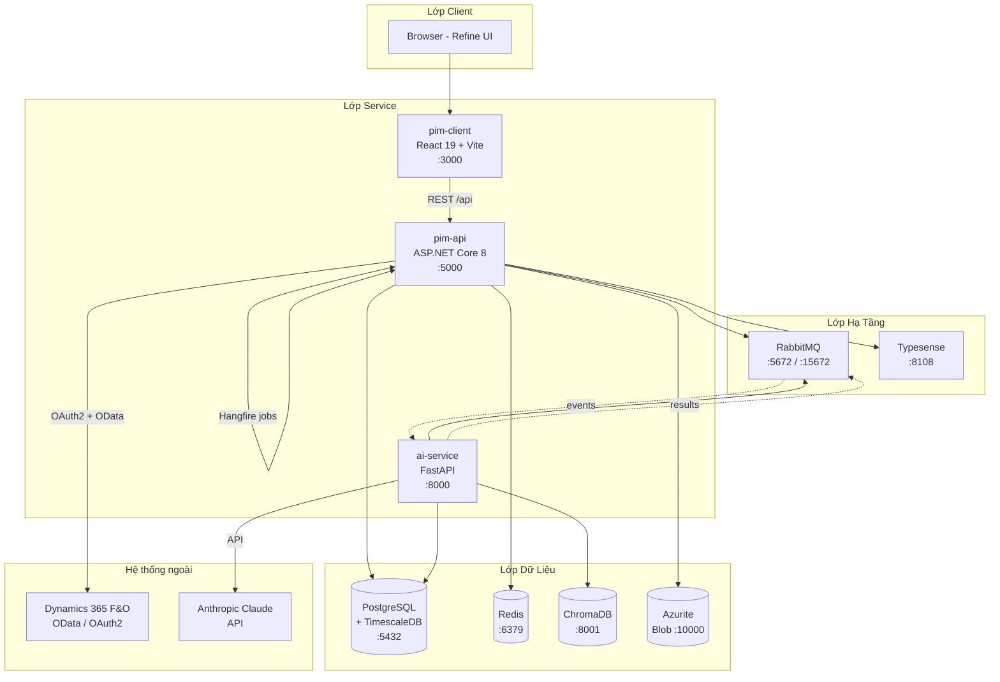
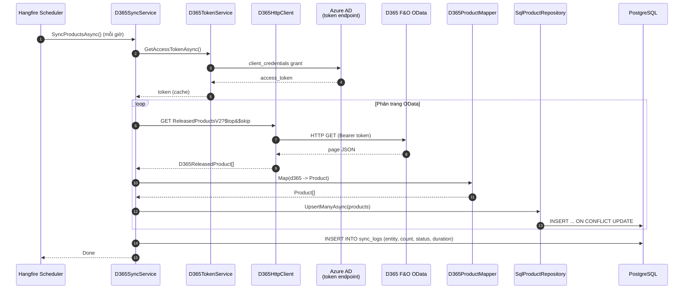

# Tổng Quan Hệ Thống PIM

> Tài liệu định hướng cho thành viên mới: hiểu hệ thống làm gì, gồm những gì, dữ liệu chảy ra sao, đã làm tới đâu và cách chạy local.

## TL;DR

PIM (Product Information Management) là hub nội dung sản phẩm tập trung, đồng bộ master data từ **Microsoft Dynamics 365 F&O** và làm phong phú bằng nội dung biên tập (text đa ngôn ngữ, ảnh/video, tài liệu) cùng AI để phục vụ đa kênh phân phối.

Hệ thống gồm **3 microservice** (`pim-api` ASP.NET Core 8, `pim-client` React 19 + Refine, `ai-service` FastAPI + Anthropic Claude) chạy trên nền hạ tầng container hóa: **PostgreSQL/TimescaleDB, Redis, RabbitMQ, Typesense, ChromaDB, Azurite**. Toàn bộ orchestrate bằng Docker Compose.

Trạng thái hiện tại: **Phase 1** — CRUD nội dung và sync products D365 đã chạy; AI, search, image engine, auth còn đang triển khai.

---

## 1. Mục Tiêu Nghiệp Vụ

Trích từ [Business_Requirements_Document_PIM.md](Business_Requirements_Document_PIM.md):

- **Tập trung hóa nội dung sản phẩm** — một nguồn sự thật duy nhất (Single Source of Truth) cho mọi kênh: website, e-commerce, catalogue, social, sales tool.
- **Đồng nhất chất lượng** — quy trình duyệt nội dung, versioning, completeness score giúp đảm bảo sản phẩm đủ thông tin trước khi public.
- **Tăng tốc go-to-market** — biên tập song song giữa marketing/sales/PM, AI hỗ trợ sinh mô tả và caption nhanh.
- **Tích hợp ERP** — pull master data (range, master, variant, pricing, dimension, category, attribute, translation, lifecycle) từ D365 F&O thay vì nhập tay.

### Personas

| Vai trò | Sử dụng PIM để |
|---------|----------------|
| Product Manager | Khai báo cấu trúc range/master/variant, chọn trạng thái lifecycle |
| Marketing | Viết mô tả B2B/B2C, USP, soạn caption, gắn lifestyle assets |
| Sales | Tải catalogue, tech sheet, lookup nhanh thông tin sản phẩm |
| Content Editor | Upload và quản lý packshot, line drawing, 3D CAD, video |
| Admin | Cấu hình entity D365, quy trình duyệt, user/role |

### Phạm vi chức năng

`Visual assets` · `Text content (đa ngôn ngữ + version)` · `Documents` · `Metadata & dynamic attributes` · `D365 sync` · `Image engine (resize/transform)` · `AI content generation` · `Search & vector similarity` · `Approval workflow` · `Multi-channel distribution`

---

## 2. Kiến Trúc Tổng Quan

### Sơ đồ topology



### Bảng port mapping

| Thành phần | Port host | Mục đích |
|------------|-----------|----------|
| `pim-api` | `5000` → `8080` container | REST API + Swagger + Hangfire dashboard |
| `pim-client` | `3000` | Vite dev server |
| `ai-service` | `8000` | FastAPI |
| `postgres` | `5432` | DB chính (TimescaleDB extension) |
| `redis` | `6379` | Cache/distributed lock |
| `rabbitmq` | `5672` AMQP, `15672` UI | Message broker |
| `typesense` | `8108` | Full-text search |
| `chromadb` | `8001` → `8000` container | Vector DB cho AI |
| `azurite` | `10000-10002` | Emulator Azure Blob |

Định nghĩa đầy đủ: [docker-compose.yml](../docker-compose.yml).

### Luồng dữ liệu chính

1. **CRUD nội dung**: `pim-client` → `pim-api` (REST `/api/...`) → repository (Dapper) → PostgreSQL.
2. **Đồng bộ D365**: Hangfire recurring `d365-product-sync` (hàng giờ) → `D365SyncService` → OAuth2 token → OData paging → mapper → upsert vào `products` + ghi `sync_logs`.
3. **AI generation** (kế hoạch): `pim-api` publish event lên RabbitMQ → `ai-service` consume → gọi Anthropic Claude → publish kết quả → `pim-api` cập nhật DB.
4. **Asset upload** (kế hoạch): client upload → `pim-api` → Azurite/Azure Blob → metadata vào `visual_assets`, sau đó job xử lý ảnh (resize/format).

---

## 3. Các Microservice

### 3.1 `pim-api` — ASP.NET Core 8

**Clean Architecture 4 layer** (định nghĩa tại [Pim.sln](../pim-api/Pim.sln)):

| Project | Trách nhiệm |
|---------|-------------|
| `Pim.Api` | Controllers, middleware, DI bootstrap, Hangfire setup |
| `Pim.Application` | Service interfaces, DTOs, business logic |
| `Pim.Domain` | Entities, enums (không phụ thuộc) |
| `Pim.Infrastructure` | Repository (Dapper + Npgsql), D365 client, integration |

**Startup pipeline** ([Program.cs](../pim-api/src/Pim.Api/Program.cs)):

```
RequestLoggingMiddleware
  → GlobalExceptionHandlerMiddleware
    → Swagger (Dev)
      → HttpsRedirection → CORS "Spa" → Authorization
        → Hangfire dashboard /hangfire (Dev)
          → MapControllers
```

**Recurring job**: `d365-product-sync` chạy `Cron.Hourly` gọi `ID365SyncService.SyncProductsAsync()`.

**Controllers** ([Pim.Api/Controllers](../pim-api/src/Pim.Api/Controllers)):

| Controller | Phạm vi |
|------------|---------|
| `ProductsController` | CRUD products, search theo range/master, lookup theo D365 item number, list variants của product |
| `VariantsController` | CRUD variants (color/size/style/configuration) |
| `VisualAssetsController` | Asset metadata (packshot, lifestyle image/video, line drawing, 3D CAD, swatch) |
| `TextContentsController` | Text đa ngôn ngữ (B2B/B2C description, USP, care, technical) với version |
| `ProductDocumentsController` | Catalogue, tech sheet, các tài liệu khác |
| `SyncController` | Manual trigger `POST /api/sync/products`, `/variants`; probe entity D365 |

Mọi response bọc trong `ApiResponse<T>` thống nhất: `{ success, message, data, statusCode }` ([ApiResponse.cs](../pim-api/src/Pim.Api/Common/ApiResponse.cs)).

### 3.2 `pim-client` — React 19 + Refine

Khung CRUD admin dùng **Refine 5** + **Material-UI 6** + **MUI X DataGrid**.

- Wiring: [App.jsx](../pim-client/src/App.jsx) cấu hình resources `dashboard`, `products`, `variants`, `assets`, `text-contents`.
- Data layer: [dataProvider.js](../pim-client/src/dataProvider.js) bọc `@refinedev/simple-rest`, unwrap `ApiResponse<T>` (đọc `json.data`, `json.total`).
- Rich text: `react-quill-new` cho biên tập text content.
- i18n: `i18next` + `react-i18next` (chuẩn bị đa ngôn ngữ).
- Test: Vitest 3 + Testing Library + MSW (skeleton).

Trang chính trong [pim-client/src/pages](../pim-client/src/pages):

| Trang | Chức năng |
|-------|-----------|
| `dashboard/` | Stats + recent activity + completeness scoreboard |
| `products/` | DataGrid list + show/edit/create form |
| `variants/` | List variants |
| `assets/` | Gallery grid + asset detail/preview |
| `text-contents/` | DataGrid + rich text editor (Quill) |

### 3.3 `ai-service` — FastAPI + Anthropic

Code nhỏ gọn tại [ai-service/main.py](../ai-service/main.py), dependencies tại [requirements.txt](../ai-service/requirements.txt) (`fastapi`, `anthropic`, `chromadb`, `pika`, `Pillow`, `httpx`).

Endpoints hiện tại (đa số stub, chờ wire vào RabbitMQ + Claude SDK):

| Endpoint | Mục đích |
|----------|----------|
| `GET /health` | Health probe |
| `POST /api/ai/generate-text` | Sinh description, USP, care instruction từ prompt sản phẩm |
| `POST /api/ai/generate-caption` | Sinh caption mạng xã hội |
| `POST /api/ai/tag-image` | Auto-tag ảnh bằng vision model |

Roadmap AI: text gen (P1) → image tag (P1) → caption (P2) → quality check (P2) → embedding similarity qua ChromaDB (P2) → AI rendering (P3 nghiên cứu).

---

## 4. Mô Hình Miền

### Entity chính ([Pim.Domain/Entities](../pim-api/src/Pim.Domain/Entities))

| Entity | Vai trò |
|--------|---------|
| `Product` | Lõi sản phẩm: range, master, variant number, name, description, USP, status, completeness score, D365 item number, last synced |
| `ProductVariant` | Biến thể với color/size/style/configuration |
| `ProductCategory`, `ProductCategoryHierarchy`, `ProductCategoryAssignment` | Cấu trúc phân loại đa cấp |
| `ProductAttributeDefinition`, `ProductAttributeValue` | EAV cho thuộc tính động (Designer, Material, ...) |
| `ProductPricing`, `ProductDimension` | Cache pricing + kích thước từ D365 |
| `ProductTranslation`, `VariantDimensionTranslation` | Bản dịch tên/mô tả/dimension |
| `ProductLifecycleState` | Trạng thái lifecycle sản phẩm |
| `VisualAsset` | Metadata file ảnh/video/CAD; file thật ở Blob |
| `TextContent` | Text đa ngôn ngữ + version + duyệt |
| `ProductDocument` | Catalogue, technical sheet |
| `SyncLog` | Audit trail mỗi lần đồng bộ D365 |

### Enum chủ chốt ([Pim.Domain/Enums](../pim-api/src/Pim.Domain/Enums))

- `AssetType` — `Packshot`, `LifestyleImage`, `LineDrawing`, `CadFile3D`, `LifestyleVideo`, `ProductVideo`, `MaterialSwatch`, `Other`
- `AssetStatus` — workflow trạng thái asset
- `ContentStatus` — `Draft`, `InReview`, `Approved`, `Published`, `Archived`
- `TextContentType` — `DesignDescriptionB2B`, `DesignDescriptionB2C`, `UniqueSellingProposition`, `CareInstruction`, `UpholsteryDescription`, `TechnicalDescription`, `Other`
- `DocumentType`, `ProductLevel`

### Database schema

Migration kiểu Flyway tại [pim-api/migrations/db/pim_db](../pim-api/migrations/db/pim_db):

- **Module 1 — Content Management** ([V001](../pim-api/migrations/db/pim_db/V001__module1_content_management.sql)): `products`, `visual_assets`, `text_contents`, `product_documents`.
- **Module 2 — Dynamic D365 Entities** ([V002](../pim-api/migrations/db/pim_db/V002__module2_dynamic_entities.sql)): `product_category_hierarchies`, `product_categories`, `product_category_assignments`, `product_attribute_definitions`, `product_attribute_values`, `product_translations`, `product_pricing`, `product_dimensions`, `product_lifecycle_states`, `sync_logs`.
- Bootstrap ban đầu (TimescaleDB extension): [docker/init-db.sql](../docker/init-db.sql).

---

## 5. Tích Hợp D365

### Sequence đồng bộ products



### Cấu hình D365 ([D365Options.cs](../pim-api/src/Pim.Infrastructure/D365/D365Options.cs))

`TenantId`, `ClientId`, `ClientSecret`, `Scope`, `BaseUrl`, `DataAreaId` — cấu hình bằng `appsettings.json` hoặc env vars. Môi trường UAT trỏ tới `responsevn-uat.sandbox.operations.dynamics.com`.

### Phạm vi sync

`D365SyncService` ([D365SyncService.cs](../pim-api/src/Pim.Infrastructure/D365/D365SyncService.cs)) hỗ trợ: `SyncProductsAsync`, `SyncVariantsAsync`, `SyncCategoriesAsync`, `SyncAttributeValuesAsync`, `SyncTranslationsAsync`, `SyncPricingAsync`, `SyncDimensionsAsync`. **Hiện chỉ products được schedule recurring**; các method khác phải gọi tay qua `SyncController`.

### Tài liệu D365 chuyên sâu

- [D365_Entity_Whitelist_for_PIM.md](D365_Entity_Whitelist_for_PIM.md) — danh sách entity được lọc trong tổng số ~4,796 entity D365.
- [D365_PIM_Field_Mapping.md](D365_PIM_Field_Mapping.md) — mapping từng field D365 → PIM.
- [D365_Dynamic_Entity_Diagram.md](D365_Dynamic_Entity_Diagram.md) — sơ đồ quan hệ entity động.
- [PIM_D365_Metadata_Guide.md](PIM_D365_Metadata_Guide.md) — hướng dẫn trích metadata.
- [PIM_Entity_Gap_Analysis.md](PIM_Entity_Gap_Analysis.md) — phân tích entity còn thiếu.

---

## 6. Tech Stack

| Lớp | Công nghệ |
|-----|-----------|
| Backend API | ASP.NET Core 8, C# 12 |
| ORM | Dapper 2.1 + Npgsql 8 |
| Background jobs | Hangfire + Hangfire.PostgreSql |
| Messaging | MassTransit 8 + RabbitMQ 3 |
| Cache | StackExchange.Redis 2.8 |
| Blob storage | Azure.Storage.Blobs (Azurite local) |
| Search | Typesense 27 |
| Vector DB | ChromaDB |
| AI | Anthropic Claude (qua `anthropic` SDK Python) |
| Frontend | React 19, Vite 8, Refine 5, Material-UI 6, MUI X DataGrid 8, ReactQuill |
| AI service | FastAPI 0.115, uvicorn, Pillow, pika |
| Database | PostgreSQL 16 + TimescaleDB |
| Test BE | xUnit 2.5 |
| Test FE | Vitest 3, Testing Library, MSW |
| Container | Docker + Docker Compose |

### Quyết định công nghệ trọng yếu

| Lựa chọn | Thay vì | Lý do (xem [Recommended_Stack_Summary.md](../tech-stack/Recommended_Stack_Summary.md)) |
|----------|---------|----------------------------------------------------------------|
| PostgreSQL + TimescaleDB | Azure SQL | Self-host, chi phí thấp, time-series sẵn cho audit/analytics |
| Typesense | Azure Cognitive Search | Open-source, latency thấp, cấu hình đơn giản |
| Anthropic Claude | Azure OpenAI | Chất lượng văn bản dài tốt hơn cho mô tả sản phẩm |
| RabbitMQ | Azure Service Bus | Self-host, portable, phù hợp Docker dev |
| Hangfire | Azure Functions | Tích hợp .NET, dashboard trực quan, debug dễ |
| Dapper | EF Core | Hiệu năng SQL trực tiếp, kiểm soát query, schema phức tạp |

---

## 7. Concerns Xuyên Suốt

| Vấn đề | Hiện trạng |
|--------|------------|
| **Logging** | Built-in `ILogger<T>` + [RequestLoggingMiddleware](../pim-api/src/Pim.Api/Middleware/RequestLoggingMiddleware.cs) (method, path, status, duration). Chưa có Serilog/Application Insights. |
| **Error handling** | [GlobalExceptionHandlerMiddleware](../pim-api/src/Pim.Api/Middleware/GlobalExceptionHandlerMiddleware.cs) map exception → HTTP code (`ArgumentException`→400, `UnauthorizedAccessException`→401, `KeyNotFoundException`→404, khác→500), trả `ApiResponse<string>`. |
| **Background jobs** | Hangfire dashboard `/hangfire` (Dev), storage Postgres, recurring `d365-product-sync` hourly. |
| **Caching** | Redis đã chạy + driver tích hợp, **chưa wire** vào use case cụ thể. |
| **Messaging** | RabbitMQ + MassTransit đã cài, **chưa publish/consume** event nào. |
| **Search** | Typesense container chạy, **chưa index** dữ liệu. |
| **Vector** | ChromaDB chạy, ai-service đã có client, **chưa có pipeline embedding**. |
| **Auth/AuthZ** | ⚠️ **Chưa triển khai** — `app.UseAuthorization()` có nhưng không có authentication scheme. |
| **Test** | 3 project xUnit + Vitest cấu hình đầy đủ, hiện chỉ có `UnitTest1.cs` skeleton. |
| **CORS** | Policy `Spa` whitelist localhost dev + domain `pim.response.com.vn`, `pim-uat.response.com.vn`. |

---

## 8. Trạng Thái Triển Khai

### ✅ Đã có

- Clean Architecture 4 layer + DI rõ ràng (`AddApplication`, `AddInfrastructure`).
- CRUD đầy đủ cho products, variants, visual assets, text contents, product documents.
- D365 OAuth2 token + OData client + mapper + sync products (recurring).
- Refine UI với 5 resource (dashboard, products, variants, assets, text-contents).
- DB schema 2 module với migration versioning.
- Hangfire dashboard, structured request logging, exception middleware, ApiResponse thống nhất.
- Docker Compose dev environment với 9 service.

### ⚠️ Đang dở

- D365 sync — chỉ products schedule recurring; variants/categories/attributes/pricing/dimensions/translations phải trigger tay.
- AI service — endpoint stub, chưa gọi Claude SDK, chưa consume RabbitMQ.
- Asset upload — `VisualAsset` entity có nhưng chưa có endpoint upload, chưa wire Blob.
- Image engine — ImageSharp được nhắc trong tech stack nhưng chưa add package; chưa có job resize/transform.
- Typesense — container chạy, chưa có indexer.
- Completeness score — field tồn tại trong `Product` nhưng chưa có logic tính.
- Tests — chỉ skeleton.

### ❌ Chưa làm (gap quan trọng)

- **Authentication & Authorization** (critical, BRD yêu cầu Azure AD).
- User management, role-based access control.
- Approval workflow cho text/asset (entity sẵn sàng, thiếu engine).
- Asset upload resumable (tus.io được mention trong BRD).
- Content distribution: shareable link, automated publishing.
- Tích hợp iPaper (catalogue digital), Meta/LinkedIn/TikTok publishing.
- Analytics/reporting dashboard.
- Audit log chi tiết theo user.

### Roadmap (theo [PIM_Implementation_Plan_and_Technical_Skills_Matrix.md](PIM_Implementation_Plan_and_Technical_Skills_Matrix.md))

- **Phase 1 (Tháng 1-2)**: Core PIM CRUD + D365 sync + AI text generation + image tag.
- **Phase 2 (Tháng 3)**: Approval workflow + Typesense search + ChromaDB similarity + caption gen + completeness logic + auth.
- **Phase 3 (Tháng 4+)**: Distribution channels (iPaper, social), AI rendering R&D, analytics.

### Đề xuất ưu tiên kế tiếp

1. **Authentication** (Azure AD hoặc JWT) — chặn toàn bộ API hiện tại đang public.
2. Wire `ai-service` vào Anthropic + RabbitMQ → use case `generate-text` cho text content draft.
3. Endpoint upload asset + Azurite + image processing job (Hangfire).
4. Hàm tính completeness score + cron daily.
5. Indexer Typesense cho `products` + UI search ở client.
6. Schedule các sync method còn lại (variants, categories, attributes, pricing, dimensions).
7. Bộ test integration đầu tiên cho `ProductsController` và `D365SyncService`.

---

## 9. Chạy Local

### Khởi động toàn bộ stack

```powershell
# từ thư mục gốc repo
copy .env.example .env   # nếu có; nếu chưa thì tạo .env theo mẫu bên dưới
docker-compose up
```

`.env` tối thiểu (xem mẫu trong [.env](../.env)):

```dotenv
ANTHROPIC_API_KEY=sk-ant-...           # bắt buộc nếu test ai-service
AZURE_BLOB_CONNECTION_STRING=UseDevelopmentStorage=true
```

### URL local

| Dịch vụ | URL |
|---------|-----|
| API | http://localhost:5000 |
| Swagger | http://localhost:5000/swagger |
| Hangfire | http://localhost:5000/hangfire |
| Client | http://localhost:3000 |
| AI service | http://localhost:8000/docs |
| RabbitMQ UI | http://localhost:15672 (pim / pim_secret) |
| PostgreSQL | localhost:5432 (pim_user / pim_secret / db `pim`) |
| Typesense | http://localhost:8108 (key `pim_typesense_key`) |
| ChromaDB | http://localhost:8001 |

### Build/test từng service ngoài Docker

```powershell
# Backend
cd pim-api
dotnet build Pim.sln
dotnet test Pim.sln

# Frontend
cd pim-client
npm install
npm run dev
npm test

# AI service
cd ai-service
pip install -r requirements.txt
uvicorn main:app --reload
```

### Migrations

SQL trong [pim-api/migrations/db/pim_db](../pim-api/migrations/db/pim_db) hiện apply qua [docker/init-db.sql](../docker/init-db.sql) khi container Postgres khởi tạo lần đầu (volume `postgres_data` rỗng). Để chạy lại: `docker-compose down -v` rồi `docker-compose up`.

---

## 10. Tài Liệu Tham Khảo

| Tài liệu | Nội dung |
|----------|----------|
| [Business_Requirements_Document_PIM.md](Business_Requirements_Document_PIM.md) | BRD đầy đủ: scope, persona, user story, success metric |
| [Recommended_Stack_Summary.md](../tech-stack/Recommended_Stack_Summary.md) | So sánh stack BRD-Azure vs. stack thực tế self-host, lựa chọn cho cả 3 phase |
| [PIM_Implementation_Plan_and_Technical_Skills_Matrix.md](PIM_Implementation_Plan_and_Technical_Skills_Matrix.md) | Lộ trình triển khai theo phase + ma trận kỹ năng |
| [PIM_Entity_Gap_Analysis.md](PIM_Entity_Gap_Analysis.md) | Phân tích entity D365 còn thiếu |
| [D365_Entity_Whitelist_for_PIM.md](D365_Entity_Whitelist_for_PIM.md) | Danh sách entity D365 trong scope |
| [D365_PIM_Field_Mapping.md](D365_PIM_Field_Mapping.md) | Mapping field D365 → PIM |
| [D365_Dynamic_Entity_Diagram.md](D365_Dynamic_Entity_Diagram.md) | Sơ đồ quan hệ entity động |
| [PIM_D365_Metadata_Guide.md](PIM_D365_Metadata_Guide.md) | Hướng dẫn trích metadata |

---

*Cập nhật: 2026-05-19 · Bảo trì: cập nhật khi thêm controller, entity, microservice hoặc thay đổi infra.*
