# Software Requirements Specification (SRS)
## Module: Social Media Publishing & Tracking
### Hệ thống: PIM (Product Information Management)

---

**Phiên bản:** 1.2  
**Ngày:** 04/06/2026  
**Trạng thái:** Draft  
**Tech stack:** .NET 8 · PostgreSQL · React.js · Hangfire · Redis  
**Team:** 1 Backend Developer  

> **Changelog v1.2:**
> - Loại bỏ TikTok khỏi phạm vi — chuyển sang Phase 2 cùng Pinterest (lý do: audit kéo dài 1–2 tháng, rủi ro cao với team 1 dev)
> - Thêm FR-008: Clone / Duplicate Post
> - Thêm FR-009: Bulk Post Creation
> - Thêm FR-010: Draft Management
> - Thêm FR-011: Delete Published Post (Acceptance Criteria đầy đủ)
> - Thêm FR-012: Post Template
> - Thêm FR-013: Content Calendar View
> - Thêm FR-014: Asset Validation trước khi đăng
> - Thêm FR-015: Notification Center
> - Thêm FR-016: Export Analytics (chuyển từ OQ-007 vào Scope)
> - Thêm FR-017: Hashtag Library
> - Thêm FR-018: UTM / URL Tracking
> - Thêm FR-019: Page-level Permission (chuyển từ OQ-008 vào Scope, bổ sung bảng `social_page_permissions`)
> - Bổ sung phần Pinterest Roadmap (Phase 2) với use case đặc thù Board-centric
> - Cập nhật Database Schema, API Endpoints, Data Access Mapping, Roadmap Sprint

---

## Mục lục

1. [Giới thiệu](#1-giới-thiệu)
2. [Phạm vi hệ thống](#2-phạm-vi-hệ-thống)
3. [Stakeholder & Người dùng](#3-stakeholder--người-dùng)
4. [Yêu cầu chức năng](#4-yêu-cầu-chức-năng)
5. [Yêu cầu phi chức năng](#5-yêu-cầu-phi-chức-năng)
6. [Kiến trúc hệ thống](#6-kiến-trúc-hệ-thống)
7. [Data Access Strategy](#7-data-access-strategy)
8. [Database Schema](#8-database-schema)
9. [Stored Procedures](#9-stored-procedures)
10. [Tích hợp API từng nền tảng](#10-tích-hợp-api-từng-nền-tảng)
11. [Data Model chi tiết](#11-data-model-chi-tiết)
12. [Luồng nghiệp vụ](#12-luồng-nghiệp-vụ)
13. [Xử lý lỗi & Resilience](#13-xử-lý-lỗi--resilience)
14. [Bảo mật](#14-bảo-mật)
15. [Roadmap triển khai](#15-roadmap-triển-khai)
16. [Rủi ro & Quyết định kỹ thuật](#16-rủi-ro--quyết-định-kỹ-thuật)
17. [Open Questions](#17-open-questions)
18. [Pinterest Roadmap — Phase 2](#18-pinterest-roadmap--phase-2)

---

## 1. Giới thiệu

### 1.1 Mục đích tài liệu

Tài liệu này mô tả đầy đủ yêu cầu phần mềm cho module **Social Media Publishing & Tracking** trong hệ thống PIM. Module cho phép team Marketing đăng bài sản phẩm lên các mạng xã hội trực tiếp từ PIM, đồng thời cung cấp cho Sales khả năng tra cứu lịch sử đăng bài, nội dung, hình ảnh đã dùng và hiệu quả (performance metrics) của từng sản phẩm trên từng nền tảng.

### 1.2 Bối cảnh

Hiện tại, team Marketing đăng bài thủ công lên từng nền tảng mạng xã hội. Sales không có cách truy vết bài đăng nào đang live, nội dung và hình ảnh đã dùng là gì, hay hiệu quả ra sao. Đây là **khoảng trống nghiệp vụ** cần được lấp đầy bằng module này.

### 1.3 Định nghĩa & Viết tắt

| Thuật ngữ | Giải thích |
|-----------|-----------|
| PIM | Product Information Management — hệ thống quản lý thông tin sản phẩm trung tâm |
| Master Number | Mã sản phẩm cấp Master trong PIM |
| Variant Number | Mã biến thể sản phẩm (màu sắc, kích thước...) |
| Range Name | Tên dòng sản phẩm |
| Platform Account | Tài khoản Business/Creator cấp cao nhất trên nền tảng (1 account có thể có nhiều Page) |
| Social Page | Fan Page, Instagram Business Account, LinkedIn Company Page — đơn vị đăng bài |
| Platform Post ID | ID bài đăng do nền tảng (Meta/LinkedIn) trả về |
| Page Access Token | Token đặc biệt của Meta dùng để đăng bài lên Facebook Page cụ thể |
| ISocialGateway | Interface abstraction layer dùng để chuẩn hóa giao tiếp với mọi nền tảng |
| MDP | Marketing Developer Platform — gói API trả phí của LinkedIn |
| PKCE | Proof Key for Code Exchange — phương thức OAuth 2.0 an toàn cho public client |
| EF Core | Entity Framework Core — ORM dùng cho các thao tác ghi (Insert/Update/Delete) |
| Dapper | Micro-ORM dùng cho các query phức tạp và báo cáo (Read/Report) |
| SP | Stored Procedure — logic query đặt tại PostgreSQL, gọi qua Dapper |
| UTM | Urchin Tracking Module — tham số theo dõi traffic trong URL |
| Draft | Bài đăng đã tạo nhưng chưa submit để đăng hoặc lên lịch |

---

## 2. Phạm vi hệ thống

### 2.1 Trong phạm vi (In Scope) — Phase 1

- Quản lý nhiều **Fan Page / Account** trên cùng một nền tảng (multi-page per platform)
- Đăng bài lên **Facebook Page** (ảnh, video, text, carousel)
- Đăng bài lên **Instagram Business** (ảnh, carousel, Reels)
- Đăng bài lên **LinkedIn Company Page** (qua third-party API: Zernio/Ayrshare)
- Lên lịch đăng bài (scheduled publishing)
- Clone / Duplicate bài đăng sang Draft mới
- Bulk Post Creation — tạo hàng loạt Draft từ nhiều sản phẩm
- Draft Management — lưu, sửa, xóa Draft
- Content Template — tạo template caption có merge field
- Content Calendar — giao diện lịch Month/Week View
- Asset Validation — kiểm tra ràng buộc trước khi submit
- Notification Center — thông báo publish, token, sync
- Quản lý quyền theo Page (`social_page_permissions`)
- Hashtag Library — quản lý hashtag group yêu thích
- UTM / URL Tracking — tự động gắn tham số UTM vào link
- Đồng bộ analytics tự động (impressions, reach, likes, comments, shares)
- Export báo cáo Analytics (Excel / CSV)
- Sales View: tra cứu lịch sử đăng bài theo sản phẩm, theo page, theo nền tảng
- Soft Delete bài đã đăng — xóa trên platform, giữ lịch sử analytics
- Quản lý OAuth token (refresh tự động, alert khi hết hạn)
- Ghi log toàn bộ request/response với platform API
- Webhook receiver xử lý callback từ Meta

### 2.2 Ngoài phạm vi (Out of Scope) — Phase 1

- **TikTok** — chuyển sang Phase 2 (audit kéo dài 1–2 tháng, rủi ro cao với team 1 dev)
- **Pinterest** — chuyển sang Phase 2 (xem mục 18 cho roadmap chi tiết)
- YouTube, X (Twitter), Snapchat
- Paid advertising / Boost post qua API
- Social listening / Brand monitoring
- Comment management / Reply to comments
- A/B testing nội dung bài đăng
- AI auto-generate caption (tích hợp sau)

---

## 3. Stakeholder & Người dùng

### 3.1 Stakeholder

| Stakeholder | Vai trò | Quan tâm chính |
|-------------|---------|----------------|
| Marketing Manager | Approver nội dung | Bài đăng đúng brand, đúng schedule, đúng Page |
| Marketing Executive | Người dùng chính | Soạn và đăng bài nhanh từ PIM, chọn đúng Page |
| Sales Manager | Viewer | Biết sản phẩm đang live ở đâu, Page nào |
| Sales Executive | Viewer | Tra cứu content đã dùng để tư vấn khách |
| IT/Dev Team | Builder & Maintainer | Kiến trúc, tích hợp API, bảo mật |

### 3.2 User Roles & Permissions

| Role | Quyền |
|------|-------|
| `social.publisher` | Soạn, đăng, lên lịch, xóa bài trên các Page được phân quyền theo `social_page_permissions` |
| `social.scheduler` | Chỉ lên lịch, không đăng ngay |
| `social.viewer` | Xem lịch sử và analytics (Sales) |
| `social.admin` | Toàn quyền + quản lý OAuth token + quản lý Page + phân quyền Page cho user |

---

## 4. Yêu cầu chức năng

### 4.1 FR-001: Kết nối tài khoản & quản lý Fan Page

**Mô tả:** Admin kết nối tài khoản Business trên từng nền tảng vào PIM. Mỗi nền tảng có thể có 1 hoặc nhiều Fan Page/Account được quản lý riêng biệt.

**Acceptance Criteria:**
- Admin vào Settings → Social Accounts → Connect
- Sau khi OAuth authorize, hệ thống tự động lấy danh sách Pages thuộc account đó (Meta API: `/me/accounts`)
- Mỗi Page được lưu thành 1 record trong `social_pages` với token riêng
- Admin có thể enable/disable từng Page độc lập
- Hiển thị danh sách Pages với trạng thái: Active / Token Expired / Disabled
- Hỗ trợ kết nối nhiều account cùng nền tảng (ví dụ: 2 Facebook Business Manager khác nhau)
- Ví dụ thực tế: Facebook có thể có "Brand Vietnam Page" + "Brand Thailand Page" + "Brand Global Page" — tất cả từ 1 lần connect

### 4.2 FR-002: Soạn và đăng bài

**Mô tả:** Marketing soạn bài đăng từ trang sản phẩm trong PIM, chọn Page cụ thể muốn đăng, và publish.

**Acceptance Criteria:**
- Chọn sản phẩm → tab "Social Posts" → nút "New Post"
- Chọn nền tảng → chọn **Page cụ thể** (dropdown chỉ hiển thị Pages user được phân quyền)
- Nhập caption (có character counter theo từng nền tảng)
- Chọn asset từ PIM DAM (hình ảnh / video đã có trong hệ thống)
- **Asset Validation tự động** chạy trước khi cho phép Submit (xem FR-014)
- Preview bài đăng theo từng nền tảng trước khi submit
- Đăng ngay hoặc chọn ngày giờ schedule
- Sau khi publish thành công: lưu `platform_post_id` và `post_url` gắn với `social_page_id`
- Cho phép đăng cùng 1 bài lên nhiều Pages cùng lúc (tạo nhiều `social_post` record)
- Nếu UTM tracking được bật, tự động gắn tham số UTM vào link trong caption (xem FR-018)

**Ràng buộc:**
- Instagram: chỉ hỗ trợ ảnh và video, không hỗ trợ text-only
- Facebook: hỗ trợ text, ảnh, video, carousel, link post
- Caption limit: Facebook 63,206 ký tự · Instagram 2,200 · LinkedIn 3,000

### 4.3 FR-003: Lên lịch đăng bài (Scheduled Publishing)

**Mô tả:** Marketing chọn ngày giờ đăng bài trong tương lai. Hệ thống tự động đăng đúng giờ lên đúng Page.

**Acceptance Criteria:**
- Chọn datetime (timezone-aware, lưu UTC trong DB)
- Bài scheduled hiển thị status = `Scheduled` với countdown
- Có thể edit hoặc hủy bài scheduled trước khi publish
- Hangfire job thực hiện publish đúng `scheduled_at ± 1 phút`
- Nếu publish fail: retry tối đa 3 lần, rồi chuyển `Dead_Letter`, gửi notification (xem FR-015)

### 4.4 FR-004: Xem lịch sử bài đăng (Sales View)

**Mô tả:** Sales tra cứu toàn bộ bài đăng của một sản phẩm trên mọi nền tảng, mọi Page.

**Acceptance Criteria:**
- Vào trang sản phẩm → tab "Social Posts"
- Hiển thị danh sách bài đăng với: thumbnail asset đã dùng, nền tảng, **tên Page**, caption (truncated), ngày đăng, trạng thái, link bài đăng
- Filter theo: nền tảng, **Page cụ thể**, trạng thái (Live / Scheduled / Deleted / Failed), khoảng thời gian
- Click vào bài → xem đầy đủ caption, ảnh/video đã dùng, metrics, Page đã đăng
- Metrics hiển thị: Impressions, Reach, Likes, Comments, Shares, Engagement Rate
- Bài đã xóa vẫn hiển thị với status `Deleted` (không mất lịch sử)

### 4.5 FR-005: Đồng bộ Analytics

**Mô tả:** Hệ thống tự động pull metrics từ platform API về PIM theo chu kỳ, theo từng bài đăng trên từng Page.

**Acceptance Criteria:**
- Hangfire recurring job chạy mỗi **6 giờ** cho bài đăng trong 30 ngày gần nhất
- Chạy mỗi **24 giờ** cho bài đăng cũ hơn 30 ngày
- Metrics được upsert vào `social_analytics` với `synced_at`
- Sales thấy thời điểm "Cập nhật lúc: ..."
- Nếu platform API trả lỗi: log lại, bỏ qua bài đó, không dừng toàn bộ job
- Gửi notification nếu sync fail liên tiếp > 3 lần (xem FR-015)

### 4.6 FR-006: Quản lý Token theo Page

**Mô tả:** Mỗi Page có token riêng. Hệ thống tự động refresh token trước khi hết hạn và alert khi có vấn đề.

**Acceptance Criteria:**
- Background service chạy **mỗi 24 giờ**
- Refresh token của **từng Page** khi còn **≤ 10 ngày** trước khi hết hạn
- Gửi notification (email/Slack) nếu refresh thất bại, kèm tên Page và nền tảng cụ thể (xem FR-015)
- Gửi notification cảnh báo sớm khi token còn ≤ 10 ngày (trước khi hết hạn, không phải sau khi fail)
- Admin xem danh sách Pages và trạng thái token tại Settings → Social Pages
- Không lưu plain-text token trong DB (bắt buộc encrypt)

### 4.7 FR-007: Webhook Receiver

**Mô tả:** Nhận callback từ Meta để cập nhật trạng thái bài đăng realtime.

**Acceptance Criteria:**
- Endpoint `POST /webhooks/meta` xử lý: bài bị xóa ngoài PIM → auto update status = Deleted
- Verify HMAC-SHA256 signature trước khi xử lý
- Trả về HTTP 200 trong < 5 giây (xử lý async)
- Log toàn bộ webhook payload vào `social_publish_logs`
- Nếu webhook processing fail: log payload đầy đủ để replay thủ công

---

### 4.8 FR-008: Clone / Duplicate Post *(Mới — v1.2)*

**Mô tả:** Marketing lấy một bài đăng cũ (bất kỳ trạng thái nào) và tạo ra một Draft mới kế thừa toàn bộ nội dung, cho phép chỉnh sửa trước khi đăng lại hoặc chuyển sang nền tảng / Page khác.

**Trường hợp sử dụng điển hình:**
- Lấy bài Facebook tuần trước → Copy sang Instagram → Chỉnh caption → Đăng lại
- Lấy bài Facebook VN → Duplicate → Đổi Page sang Thailand → Dịch caption → Schedule

**Acceptance Criteria:**
- Tại màn hình chi tiết bài đăng hoặc danh sách bài, có nút "Duplicate"
- Hệ thống tạo một Draft mới với:
  - `caption` sao chép nguyên vẹn từ bài gốc
  - `hashtags` sao chép nguyên vẹn
  - `social_post_assets` sao chép liên kết đến các asset gốc (không copy file vật lý)
  - `status = Draft`
  - `source_post_id` lưu ID bài gốc để truy vết
- User được redirect ngay sang màn hình Edit Draft mới
- Cho phép đổi Page (dropdown chọn Page khác, kể cả nền tảng khác)
- Cho phép đổi nền tảng — khi đổi nền tảng, hệ thống hiển thị cảnh báo về ràng buộc của nền tảng đích (ví dụ: Instagram không hỗ trợ text-only)
- Draft mới không ảnh hưởng đến bài gốc
- Ghi `created_by` = user thực hiện duplicate (không kế thừa `created_by` bài gốc)

**Schema bổ sung:**
```sql
ALTER TABLE social_posts ADD COLUMN source_post_id UUID REFERENCES social_posts(id);
```

**API:**
```
POST /api/social/posts/{id}/duplicate
→ Trả về: { draftId, redirectUrl }
```

---

### 4.9 FR-009: Bulk Post Creation *(Mới — v1.2)*

**Mô tả:** Marketing chọn nhiều sản phẩm cùng lúc và tạo hàng loạt Draft bài đăng, hoặc đăng cùng một nội dung lên nhiều Pages/nền tảng trong một thao tác.

**Trường hợp sử dụng điển hình:**
- Chọn 50 sản phẩm mới → Áp template caption → Generate 50 Draft
- Đăng cùng bài lên: Facebook VN + Facebook TH + Facebook Global + Instagram VN

**Acceptance Criteria:**

**Bulk tạo Draft từ nhiều sản phẩm:**
- Tại danh sách sản phẩm PIM, có checkbox chọn nhiều sản phẩm
- Nút "Bulk Post" → Wizard 3 bước:
  1. Chọn nền tảng + Page(s) đích
  2. Chọn hoặc nhập template caption (hỗ trợ merge field: `{{ProductName}}`, `{{RangeName}}`, `{{MasterNumber}}`)
  3. Preview tất cả Draft sẽ được tạo → Confirm
- Hệ thống tạo `N × M` Draft (N sản phẩm × M Pages được chọn)
- Mỗi Draft được tạo với `status = Draft`, merge field đã được thay thế bằng dữ liệu thực
- Sau khi tạo xong, redirect đến danh sách Draft để review và publish từng bài hoặc bulk schedule

**Bulk đăng cùng bài lên nhiều Pages:**
- Tại màn hình New Post / Edit Draft, cho phép chọn nhiều Pages đích cùng lúc (multi-select)
- Mỗi Page tạo 1 `social_post` record độc lập
- Bulk schedule: chọn ngày giờ chung, tất cả bài được schedule cùng thời điểm

**Giới hạn:**
- Tối đa 100 sản phẩm mỗi lần bulk create
- Tối đa 20 Pages mỗi lần bulk publish
- Bulk job chạy async qua Hangfire, trả về job ID ngay lập tức
- Notification khi bulk job hoàn thành (xem FR-015): "Đã tạo 47/50 Draft thành công, 3 lỗi"

**API:**
```
POST /api/social/posts/bulk-draft
Body: { productItemIds[], pageIds[], templateId?, captionTemplate? }
→ Trả về: { jobId, estimatedCount }

GET  /api/social/posts/bulk-draft/{jobId}/status
→ Trả về: { completed, total, failedItems[] }
```

---

### 4.10 FR-010: Draft Management *(Mới — v1.2)*

**Mô tả:** Marketing có thể lưu bài đang soạn thành Draft để xem lại hoặc sửa sau, mà không cần publish ngay.

**Acceptance Criteria:**

**Save Draft:**
- Tại màn hình New Post, nút "Save Draft" lưu bài với `status = Draft` mà không validate ràng buộc nền tảng (cho phép caption rỗng, chưa có asset)
- Draft được lưu gắn với `product_item_id` và `created_by`
- Hiển thị toast: "Đã lưu Draft"

**Danh sách Draft:**
- Tab "Drafts" tại màn Social Posts hiển thị tất cả Draft của user (filter theo sản phẩm, nền tảng, người tạo)
- Hiển thị: tên sản phẩm, nền tảng, Page, thời gian tạo, người tạo, caption preview

**Edit Draft:**
- Click vào Draft → mở màn hình Edit với đầy đủ nội dung đã lưu
- Cho phép thay đổi bất kỳ trường nào: caption, asset, Page, nền tảng, schedule time
- Lưu lại (vẫn là Draft) hoặc Submit (chuyển sang Scheduled / Publishing)
- Ghi lại `updated_at` và `updated_by` mỗi lần save

**Delete Draft:**
- Nút Delete chỉ hiển thị với bài có `status = Draft`
- Xác nhận trước khi xóa
- Hard delete (không cần lịch sử analytics vì Draft chưa published)
- Không cho phép xóa Draft nếu đang là nguồn của một Bulk job đang chạy

**Tự động dọn Draft cũ:**
- Draft không được chỉnh sửa trong > 90 ngày → gửi notification nhắc nhở
- Draft > 180 ngày → auto-expire (status = `Expired`), không xóa để giữ record

**API:**
```
POST   /api/social/posts/draft          Tạo Draft mới
PATCH  /api/social/posts/{id}/draft     Cập nhật Draft
DELETE /api/social/posts/{id}           Xóa Draft (chỉ cho phép nếu status = Draft)
GET    /api/social/posts/drafts         Danh sách Draft của user
```

---

### 4.11 FR-011: Delete Published Post *(Mới — v1.2)*

**Mô tả:** Marketing xóa một bài đã published khỏi nền tảng mạng xã hội. Bài bị xóa vẫn được giữ lại trong PIM với trạng thái `Deleted` để Sales có thể tra cứu lịch sử.

**Acceptance Criteria:**

**Thao tác xóa:**
- Nút "Delete Post" chỉ hiển thị với bài có `status = Published` và user có quyền trên Page đó
- Hiển thị dialog xác nhận: "Bài đăng sẽ bị xóa khỏi [Platform] — [Page Name]. Lịch sử và analytics vẫn được giữ lại."
- Gọi `ISocialGateway.DeletePostAsync(platformPostId, pageAccessToken)`
- Nếu platform API xóa thành công: `EF Core Update status = Deleted`, ghi `deleted_at = NOW()`, ghi `deleted_by`
- Nếu platform API trả lỗi: hiển thị thông báo lỗi, **không** cập nhật status trong PIM
- Ghi log vào `social_publish_logs` với `action = 'DELETE'`

**Sau khi xóa:**
- Bài vẫn hiển thị trong Sales View với status `Deleted` và badge màu đỏ
- `post_url` vẫn được lưu (để biết URL cũ, dù link đã invalid)
- Analytics đã sync trước khi xóa vẫn giữ nguyên — không xóa `social_analytics`
- `platform_post_id` giữ nguyên để truy vết

**Webhook xóa ngoài PIM:**
- Nếu bài bị xóa trực tiếp trên nền tảng (ngoài PIM): webhook Meta tự động cập nhật `status = Deleted` (xem FR-007)

**Schema bổ sung:**
```sql
ALTER TABLE social_posts ADD COLUMN deleted_by VARCHAR(100);
```

**API:**
```
DELETE /api/social/posts/{id}
→ Gọi platform API xóa → Update status = Deleted → 204 No Content
→ Nếu platform fail: 502 Bad Gateway + error detail
```

---

### 4.12 FR-012: Post Template *(Mới — v1.2)*

**Mô tả:** Marketing tạo và quản lý template caption có merge field. Khi soạn bài, chọn template và hệ thống tự động điền dữ liệu sản phẩm vào.

**Trường hợp sử dụng điển hình:**
```
Template "Ra mắt sản phẩm mới":
{{ProductName}} ✔ Premium Material ✔ Export Quality
📐 {{Dimensions}} | 🎨 {{ColorVariants}} variants
Contact us: [link]
#woodfurniture #noithat #{{RangeName}}
```

**Acceptance Criteria:**

**Quản lý Template:**
- Admin và Publisher tạo/sửa/xóa template tại Settings → Post Templates
- Mỗi template có: tên, nền tảng áp dụng (Facebook / Instagram / LinkedIn / Tất cả), nội dung caption, hashtag mặc định
- Merge fields được hỗ trợ:

| Merge Field | Dữ liệu thay thế |
|-------------|-----------------|
| `{{ProductName}}` | Tên sản phẩm từ PIM |
| `{{RangeName}}` | Tên dòng sản phẩm |
| `{{MasterNumber}}` | Mã Master từ PIM |
| `{{VariantNumber}}` | Mã Variant từ PIM |
| `{{Dimensions}}` | Kích thước từ PIM |
| `{{Material}}` | Chất liệu từ PIM |
| `{{ColorVariants}}` | Số lượng màu có sẵn |

- Merge field không có dữ liệu → hiển thị cảnh báo màu vàng, không block save

**Sử dụng Template khi soạn bài:**
- Tại màn hình New Post / Bulk Post, dropdown "Chọn Template"
- Khi chọn template: tự động điền caption + hashtag, merge fields được replace bằng dữ liệu sản phẩm thực
- User có thể chỉnh sửa tự do sau khi apply template
- Preview hiển thị kết quả merge trước khi confirm

**Schema:**
```sql
CREATE TABLE social_post_templates (
    id           UUID PRIMARY KEY DEFAULT gen_random_uuid(),
    name         VARCHAR(200) NOT NULL,
    platform     VARCHAR(20),          -- NULL = áp dụng tất cả nền tảng
    caption      TEXT NOT NULL,
    hashtags     TEXT,
    is_active    BOOLEAN NOT NULL DEFAULT TRUE,
    created_by   VARCHAR(100) NOT NULL,
    created_at   TIMESTAMPTZ NOT NULL DEFAULT NOW(),
    updated_at   TIMESTAMPTZ NOT NULL DEFAULT NOW()
);
```

**API:**
```
GET    /api/social/templates                    Danh sách templates
POST   /api/social/templates                    Tạo template
PUT    /api/social/templates/{id}               Cập nhật template
DELETE /api/social/templates/{id}               Xóa template
POST   /api/social/templates/{id}/preview       Preview merge với product data
  Body: { productItemId }
  → Trả về: { resolvedCaption, resolvedHashtags, unresolvedFields[] }
```

---

### 4.13 FR-013: Content Calendar View *(Mới — v1.2)*

**Mô tả:** Hiển thị tất cả bài đăng (Scheduled, Published, Draft) trên giao diện lịch Month View / Week View để Marketing quản lý lịch nội dung trực quan.

**Acceptance Criteria:**

**Month View:**
- Hiển thị lịch theo tháng, mỗi ngày hiển thị tối đa 3 bài (có "+N more" nếu nhiều hơn)
- Màu sắc phân biệt theo trạng thái: Draft (xám), Scheduled (xanh dương), Published (xanh lá), Failed (đỏ)
- Badge platform icon (FB / IG / LI) trên mỗi event

**Week View:**
- Hiển thị lịch theo tuần, timeline theo giờ
- Rõ giờ đăng của bài Scheduled
- Cho phép drag & drop bài Scheduled sang ngày/giờ khác → cập nhật `scheduled_at` ngay lập tức

**Filter:**
- Lọc theo nền tảng, Page, người tạo, trạng thái
- Mặc định hiển thị tất cả Pages user được phân quyền

**Interaction:**
- Click vào bài → mở panel bên phải xem chi tiết (không chuyển trang)
- Từ panel detail: nút Edit, Duplicate, Delete
- Nút "New Post" trên lịch (click vào ngày cụ thể → prefill ngày đó vào form)

**API:**
```
GET /api/social/posts/calendar?from={date}&to={date}&platform={}&pageId={}
→ Trả về: danh sách posts có scheduled_at hoặc published_at trong khoảng thời gian
   (Dapper query trực tiếp, không cần SP riêng)

PATCH /api/social/posts/{id}/reschedule
Body: { scheduledAt }
→ EF Core Update scheduled_at
```

---

### 4.14 FR-014: Asset Validation *(Mới — v1.2)*

**Mô tả:** Trước khi user submit bài đăng, hệ thống tự động kiểm tra asset (ảnh/video) có đáp ứng ràng buộc kỹ thuật của nền tảng đích không. Hiển thị lỗi cụ thể để user xử lý trước khi publish.

**Acceptance Criteria:**

**Validation chạy khi:**
- User nhấn "Publish" hoặc "Schedule"
- User nhấn "Validate" thủ công (nút kiểm tra sớm)
- Khi user đổi nền tảng / Page đích

**Ràng buộc cần validate:**

| Nền tảng | Loại | Ràng buộc | Thông báo lỗi |
|----------|------|-----------|---------------|
| Instagram | Ảnh | Kích thước tối thiểu 320×320px | ❌ Ảnh quá nhỏ — Instagram yêu cầu tối thiểu 320×320px |
| Instagram | Ảnh | Tỉ lệ 1:91 – 4:5 | ❌ Tỉ lệ ảnh không hợp lệ — Instagram chấp nhận 1.91:1 đến 4:5 |
| Instagram | Video | Kích thước tối đa 100MB | ❌ Video vượt 100MB — hãy nén hoặc chọn video khác |
| Instagram | Video | Tỉ lệ 1:1 hoặc 9:16 | ❌ Tỉ lệ video không hợp lệ cho Instagram |
| Instagram | Video | Thời lượng 3 giây – 60 giây (Feed) | ❌ Video quá dài — Instagram Feed tối đa 60 giây |
| Instagram | Carousel | Tối thiểu 2, tối đa 10 items | ❌ Carousel cần 2–10 ảnh/video |
| Facebook | Video | Kích thước tối đa 4GB | ❌ Video vượt giới hạn 4GB của Facebook |
| Facebook | Ảnh | Không hỗ trợ BMP, TIFF | ❌ Định dạng ảnh không hỗ trợ — dùng JPG, PNG, GIF, WebP |
| LinkedIn | Ảnh | Kích thước tối đa 5MB | ❌ Ảnh vượt 5MB — LinkedIn yêu cầu ảnh nhỏ hơn 5MB |
| LinkedIn | Video | Kích thước tối đa 5GB | ❌ Video vượt giới hạn LinkedIn |

**UX:**
- Lỗi block submit: hiển thị inline bên cạnh asset vi phạm + banner tổng ở đầu form
- Cảnh báo không block: hiển thị màu vàng (ví dụ: "Tỉ lệ ảnh không tối ưu cho Instagram — khuyến nghị 4:5")
- Nếu validation pass toàn bộ: hiển thị checkmark xanh "Asset hợp lệ"

**Backend:**
- `AssetValidationService.ValidateAsync(assets[], platform)` chạy server-side trước khi gọi platform API
- Metadata ảnh/video đọc từ PIM asset record (width, height, size, duration, format)
- Nếu metadata chưa có → trigger extract metadata từ CDN URL

---

### 4.15 FR-015: Notification Center *(Mới — v1.2)*

**Mô tả:** Tập trung mọi thông báo liên quan đến hoạt động Social Publishing vào một Notification Center, thay vì chỉ gửi alert token fail như hiện tại.

**Acceptance Criteria:**

**Các sự kiện tạo notification:**

| Sự kiện | Loại | Recipient | Kênh |
|---------|------|-----------|------|
| Scheduled publish thành công | ✅ Success | Người tạo bài | In-app |
| Scheduled publish thất bại | ❌ Error | Người tạo bài + Admin | In-app + Email/Slack |
| Bài vào Dead Letter (fail > 3 lần) | ❌ Error | Người tạo bài + Admin | In-app + Email/Slack |
| Token sắp hết hạn (≤ 10 ngày) | ⚠️ Warning | Admin | In-app + Email/Slack |
| Token refresh fail | ❌ Error | Admin | In-app + Email/Slack |
| Analytics sync fail liên tiếp > 3 lần | ⚠️ Warning | Admin | In-app |
| Webhook processing fail | ⚠️ Warning | Admin | In-app |
| Bulk job hoàn thành | ✅ Success | Người tạo job | In-app |
| Bulk job có item thất bại | ⚠️ Warning | Người tạo job | In-app |
| Draft sắp expire (> 90 ngày không chỉnh) | ℹ️ Info | Người tạo Draft | In-app |

**Notification Center UI:**
- Icon chuông ở header, hiển thị badge số notification chưa đọc
- Panel danh sách notification, mỗi item: icon loại, nội dung, timestamp, link đến bài liên quan
- Đánh dấu đã đọc: từng item hoặc "Mark all as read"
- Giữ lịch sử notification 90 ngày

**Cấu hình kênh alert (OQ-005 → đã chốt):**
- Cấu hình tại Settings → Notifications
- Chọn kênh: Email / Slack / Cả hai
- Nhập Slack Webhook URL hoặc email nhận alert

**Schema:**
```sql
CREATE TABLE social_notifications (
    id          UUID PRIMARY KEY DEFAULT gen_random_uuid(),
    user_id     VARCHAR(100) NOT NULL,
    type        VARCHAR(50)  NOT NULL,  -- 'publish_success' | 'publish_fail' | 'token_expiry' | ...
    severity    VARCHAR(20)  NOT NULL,  -- 'info' | 'warning' | 'error' | 'success'
    title       VARCHAR(300) NOT NULL,
    body        TEXT,
    ref_post_id UUID REFERENCES social_posts(id),
    ref_page_id UUID REFERENCES social_pages(id),
    is_read     BOOLEAN NOT NULL DEFAULT FALSE,
    created_at  TIMESTAMPTZ NOT NULL DEFAULT NOW()
);

CREATE INDEX idx_notifications_user ON social_notifications(user_id, is_read, created_at DESC);
```

**API:**
```
GET   /api/social/notifications             Danh sách notification của user (phân trang)
PATCH /api/social/notifications/{id}/read   Đánh dấu đã đọc
PATCH /api/social/notifications/read-all    Đánh dấu tất cả đã đọc
```

---

### 4.16 FR-016: Export Analytics *(Mới — v1.2 — chuyển từ OQ-007)*

**Mô tả:** Sales và Marketing có thể export báo cáo analytics ra Excel hoặc CSV để phân tích ngoài hệ thống hoặc trình bày với management.

> **Lý do đưa vào Scope:** Theo kinh nghiệm, Sales hầu như luôn yêu cầu export. Stored Procedures đã có sẵn — chỉ cần thêm endpoint và thư viện xuất file.

**Acceptance Criteria:**

**Export từ Sales View:**
- Nút "Export" trên màn hình danh sách bài đăng theo sản phẩm
- Áp dụng filter hiện tại (nền tảng, Page, trạng thái, khoảng thời gian) vào dữ liệu export
- Chọn định dạng: Excel (.xlsx) hoặc CSV (.csv)

**Nội dung file export:**

| Cột | Dữ liệu |
|-----|---------|
| Product Name | Tên sản phẩm |
| Master Number | Mã Master |
| Platform | Nền tảng |
| Page Name | Tên Page |
| Post URL | Link bài đăng |
| Status | Trạng thái |
| Published At | Ngày giờ đăng |
| Caption | Nội dung caption |
| Impressions | Tổng impression |
| Reach | Tổng reach |
| Likes | Tổng likes |
| Comments | Tổng comments |
| Shares | Tổng shares |
| Saves | Tổng saves |
| Engagement Rate | Tỉ lệ tương tác (%) |
| Analytics Synced At | Thời điểm cập nhật metrics |

**Export Dashboard:**
- Export tổng hợp theo Page/Platform từ Analytics Dashboard
- Hỗ trợ chọn khoảng thời gian tùy ý

**Kỹ thuật:**
- Backend: ClosedXML (Excel) hoặc CsvHelper (CSV) — thư viện .NET
- Dùng lại Stored Procedure `sp_GetPostsByProduct` và `sp_GetAnalyticsDashboard` — không cần SP mới
- Trả về file qua HTTP response với `Content-Disposition: attachment`
- Timeout tối đa 30 giây; nếu dataset lớn (> 5,000 rows) → generate async, gửi notification khi sẵn sàng

**API:**
```
GET /api/social/analytics/export?productItemId={}&platform={}&from={}&to={}&format=xlsx|csv
GET /api/social/analytics/dashboard/export?platform={}&from={}&to={}&format=xlsx|csv
```

---

### 4.17 FR-017: Hashtag Library *(Mới — v1.2)*

**Mô tả:** Marketing quản lý bộ sưu tập hashtag theo nhóm. Khi soạn bài, có thể chèn nhanh cả nhóm hashtag mà không cần gõ lại.

**Acceptance Criteria:**

**Quản lý Hashtag Group:**
- Tại Settings → Hashtag Library, tạo/sửa/xóa nhóm hashtag
- Mỗi nhóm có: tên nhóm, danh sách hashtag, platform áp dụng (tất cả hoặc chỉ một nền tảng), mô tả ngắn
- Ví dụ nhóm:
  - "Furniture Base": `#furniture #woodworking #interiordesign #homedecor`
  - "Vietnam Market": `#noithat #gonoithat #noithatgo #thiếtkếnộithất`
  - "Export Market": `#exportfurniture #woodcraft #handmadefurniture`
- Giới hạn 50 hashtag mỗi nhóm, 20 nhóm mỗi tài khoản

**Sử dụng khi soạn bài:**
- Tại trường Hashtags trong form New Post / Edit Draft: nút "Hashtag Library"
- Dropdown hiển thị danh sách nhóm + preview hashtag
- Click chọn nhóm → append hashtag vào field (không replace, để có thể kết hợp nhiều nhóm)
- Character counter cập nhật sau khi chèn để kiểm tra giới hạn caption

**Schema:**
```sql
CREATE TABLE social_hashtag_groups (
    id          UUID PRIMARY KEY DEFAULT gen_random_uuid(),
    name        VARCHAR(100) NOT NULL,
    platform    VARCHAR(20),
    hashtags    TEXT NOT NULL,    -- comma-separated hoặc space-separated
    description TEXT,
    is_active   BOOLEAN NOT NULL DEFAULT TRUE,
    created_by  VARCHAR(100) NOT NULL,
    created_at  TIMESTAMPTZ NOT NULL DEFAULT NOW()
);
```

**API:**
```
GET    /api/social/hashtag-groups           Danh sách nhóm hashtag
POST   /api/social/hashtag-groups           Tạo nhóm
PUT    /api/social/hashtag-groups/{id}      Cập nhật nhóm
DELETE /api/social/hashtag-groups/{id}      Xóa nhóm
```

---

### 4.18 FR-018: UTM / URL Tracking *(Mới — v1.2)*

**Mô tả:** Hệ thống tự động gắn tham số UTM vào các URL trong caption bài đăng, giúp Marketing đo lường traffic từng kênh / Page / chiến dịch trong Google Analytics.

**Acceptance Criteria:**

**Cấu hình UTM:**
- Tại Settings → UTM Tracking: bật/tắt tính năng, cấu hình tham số mặc định
- Hỗ trợ dynamic value qua placeholder:

| Tham số UTM | Giá trị mặc định | Placeholder hỗ trợ |
|-------------|------------------|-------------------|
| `utm_source` | `facebook` | `{{platform}}` |
| `utm_medium` | `social` | (cố định) |
| `utm_campaign` | `summer2026` | Nhập thủ công |
| `utm_content` | `vn-page` | `{{pageName}}` |
| `utm_term` | (trống) | `{{masterNumber}}` |

**Tự động gắn UTM:**
- Khi user nhập URL vào caption, hệ thống detect và hiển thị preview URL sau khi gắn UTM
- User có thể bật/tắt UTM cho từng bài riêng lẻ (checkbox "Gắn UTM tracking")
- UTM được gắn vào `post_url` thực tế sau khi publish (lưu cả URL gốc và URL có UTM)
- Nếu URL đã có sẵn tham số query string → append thêm, không replace

**Pinterest (Phase 2):** Pinterest có destination URL riêng — UTM gắn vào `destination_url` của Pin, không phải caption.

**Schema bổ sung:**
```sql
ALTER TABLE social_posts ADD COLUMN destination_url TEXT;       -- URL gốc
ALTER TABLE social_posts ADD COLUMN destination_url_utm TEXT;   -- URL sau khi gắn UTM
ALTER TABLE social_posts ADD COLUMN utm_campaign VARCHAR(200);  -- Chiến dịch override per-post
```

**API:**
```
GET  /api/social/utm/settings           Cấu hình UTM hiện tại
PUT  /api/social/utm/settings           Cập nhật cấu hình
POST /api/social/utm/preview            Preview URL sau khi gắn UTM
  Body: { url, platform, pageId, campaign? }
```

---

### 4.19 FR-019: Quản lý quyền theo Page *(Mới — v1.2 — chuyển từ OQ-008)*

**Mô tả:** Một user chỉ có thể đăng bài lên các Page được Admin phân quyền, không phải tất cả Pages trong hệ thống.

> **Lý do đưa vào Scope:** Đây không phải Open Question — đây là yêu cầu nghiệp vụ bắt buộc. Marketing VN không nên đăng được lên Page TH.

**Trường hợp sử dụng:**

| User | Pages được phép |
|------|----------------|
| Marketing VN | Facebook VN Page, Instagram VN |
| Marketing TH | Facebook TH Page, Instagram TH |
| Global Team | Tất cả Pages |
| Admin | Tất cả Pages + quản lý phân quyền |

**Acceptance Criteria:**

**Phân quyền (Admin):**
- Tại Settings → Page Permissions: Admin chọn user + chọn Pages được phép
- Có thể grant theo từng Page hoặc "All Pages" cho Global role
- Lưu vào bảng `social_page_permissions`

**Áp dụng:**
- Khi user mở form New Post: dropdown Page chỉ hiển thị Pages user được phân quyền
- Nếu user không có quyền trên bất kỳ Page nào → hiển thị thông báo "Liên hệ Admin để được phân quyền Page"
- API endpoint tạo/đăng bài: kiểm tra permission trước khi xử lý, trả 403 nếu không có quyền
- `social.admin` luôn có quyền tất cả Pages, không cần record trong bảng permission

**Schema:**
```sql
CREATE TABLE social_page_permissions (
    id          UUID PRIMARY KEY DEFAULT gen_random_uuid(),
    user_id     VARCHAR(100) NOT NULL,  -- PIM user ID / email
    page_id     UUID         NOT NULL REFERENCES social_pages(id) ON DELETE CASCADE,
    granted_by  VARCHAR(100) NOT NULL,
    granted_at  TIMESTAMPTZ  NOT NULL DEFAULT NOW(),
    UNIQUE (user_id, page_id)
);

CREATE INDEX idx_page_permissions_user ON social_page_permissions(user_id);
CREATE INDEX idx_page_permissions_page ON social_page_permissions(page_id);
```

**API:**
```
GET    /api/social/pages/my-pages                           Pages user hiện tại được phép
GET    /api/social/permissions/pages                        (Admin) Toàn bộ phân quyền
POST   /api/social/permissions/pages                        (Admin) Cấp quyền
  Body: { userId, pageIds[] }
DELETE /api/social/permissions/pages/{userId}/{pageId}      (Admin) Thu hồi quyền
```

---

## 5. Yêu cầu phi chức năng

### 5.1 Hiệu năng (Performance)

| Chỉ số | Yêu cầu |
|--------|---------|
| Sales View API (query có filter + join) | < 500ms (P95) — đảm bảo nhờ SP + index |
| Publish API response | < 3 giây (trả về job ID, publish async) |
| Analytics sync job | Hoàn thành trong < 30 phút cho 10,000 bài |
| Scheduler accuracy | ± 1 phút so với scheduled_at |
| Report phức tạp (cross-platform, nhiều Page) | < 2 giây — dùng SP tối ưu |
| Export file (≤ 5,000 rows) | < 30 giây |
| Asset Validation | < 2 giây |
| Calendar View API | < 500ms cho 1 tháng |

### 5.2 Độ tin cậy (Reliability)

- Uptime module: ≥ 99.5%
- Retry logic: tối đa 3 lần, exponential backoff (1s, 4s, 16s)
- Circuit breaker: mở sau 5 lỗi liên tiếp, thử lại sau 30 giây
- Dead Letter Queue: bài fail quá 3 lần → Notification + manual review
- Bulk job: từng item xử lý độc lập — 1 item fail không dừng toàn bộ job

### 5.3 Bảo mật (Security)

- OAuth token mã hóa AES-256-GCM trước khi lưu DB
- Webhook signature verification bắt buộc (HMAC-SHA256)
- Role-based access control cho mọi endpoint
- Page-level permission check trên mọi write operation
- Không log plain-text token trong bất kỳ log nào
- Rate limit API: 100 request/phút/user

### 5.4 Khả năng mở rộng (Scalability)

- Kiến trúc `ISocialGateway` cho phép thêm nền tảng mới (TikTok, Pinterest Phase 2) mà không sửa business logic
- Multi-page: thêm Page mới không cần code, chỉ cần connect qua UI
- Hangfire hỗ trợ horizontal scaling (nhiều worker)
- Stored Procedures dễ optimize index độc lập với application code
- Bulk job dùng Hangfire batch — scale horizontally khi cần

### 5.5 Khả năng bảo trì (Maintainability)

- **EF Core** chỉ dùng cho write operations → migration rõ ràng, audit trail đầy đủ
- **Dapper + SP** cho read/report → DBA có thể optimize SP độc lập, không cần deploy lại app
- Mỗi Platform Adapter độc lập, có thể test riêng
- Feature flag để enable/disable từng nền tảng / từng Page / từng FR mới mà không cần deploy

---

## 6. Kiến trúc hệ thống

```
┌─────────────────────────────────────────────────────────────┐
│  Layer 1 — PIM API (ASP.NET Core 8)                        │
│  POST /social/posts · GET /social/posts/{productId}        │
│  GET /social/analytics/{postId} · POST /webhooks/*         │
│  GET /social/pages · POST /social/auth/{platform}/connect  │
│  POST /social/posts/{id}/duplicate                         │
│  POST /social/posts/bulk-draft                             │
│  GET  /social/posts/calendar                               │
│  GET  /social/analytics/export                             │
└─────────────────────────┬───────────────────────────────────┘
                          │ MediatR Commands/Queries
┌─────────────────────────▼───────────────────────────────────┐
│  Layer 2 — Application Services (CQRS)                     │
│  Commands (EF Core):  PublishPostCommand                   │
│                       SchedulePostCommand                  │
│                       ConnectPageCommand                   │
│                       DuplicatePostCommand                 │
│                       BulkCreateDraftCommand               │
│                       DeletePublishedPostCommand           │
│  Queries  (Dapper+SP): GetPostsByProductQuery              │
│                        GetAnalyticsDashboardQuery          │
│                        GetPageListQuery                    │
│                        GetCalendarPostsQuery               │
│                        ExportAnalyticsQuery                │
└─────────────────────────┬───────────────────────────────────┘
                          │
┌─────────────────────────▼───────────────────────────────────┐
│  Layer 3 — ISocialGateway (Abstraction Interface)          │
│  PublishAsync · GetAnalyticsAsync · DeletePostAsync        │
└──────┬──────────────────────────────┬────────────────────────┘
       │                              │
┌──────▼──────┐         ┌─────────────▼──────────┐
│MetaAdapter  │         │LinkedInAdapter         │
│FB + IG      │         │via Zernio (3rd party)  │
│Graph API v21│         │API Key auth            │
└──────┬──────┘         └─────────────┬──────────┘
       │                              │
┌──────▼──────────────────────────────▼──────────┐
│  Layer 4 — Data Access (Dual Strategy)         │
│  ┌──────────────────┐  ┌──────────────────────┐│
│  │ EF Core (Write)  │  │ Dapper + SP (Read)   ││
│  │ Insert/Update/   │  │ GetPostsByProduct_SP  ││
│  │ Delete/Migration │  │ GetAnalyticsDash_SP   ││
│  │ Entity tracking  │  │ GetPagePerformance_SP ││
│  └──────────────────┘  └──────────────────────┘│
│  PostgreSQL + Hangfire + Redis + Webhook        │
└─────────────────────────┬───────────────────────┘
                          │ IHostedService
┌─────────────────────────▼───────────────────────┐
│  Layer 5 — Background Services                  │
│  TokenManager · AnalyticsSyncJob               │
│  ScheduledPublishJob · BulkCreateJob           │
│  NotificationDispatchJob · ExportGenerateJob   │
└─────────────────────────────────────────────────┘
```

### 6.1 Dependency Injection — Keyed Services (.NET 8)

```csharp
services.AddKeyedScoped<ISocialGateway, MetaAdapter>("facebook");
services.AddKeyedScoped<ISocialGateway, MetaAdapter>("instagram");
services.AddKeyedScoped<ISocialGateway, LinkedInAdapter>("linkedin");
// TikTok + Pinterest: Phase 2
// services.AddKeyedScoped<ISocialGateway, TikTokAdapter>("tiktok");
// services.AddKeyedScoped<ISocialGateway, PinterestAdapter>("pinterest");

var adapter = serviceProvider.GetRequiredKeyedService<ISocialGateway>(page.Platform);
await adapter.PublishAsync(request, cancellationToken);
```

---

## 7. Data Access Strategy

### 7.1 Nguyên tắc phân tách

| Loại thao tác | Công cụ | Lý do |
|---------------|---------|-------|
| Insert bài đăng mới | EF Core | Entity tracking, transaction, migration rõ ràng |
| Update status bài đăng | EF Core | Optimistic concurrency, audit trail |
| Insert analytics snapshot | EF Core | Upsert đơn giản, không cần join phức tạp |
| Lưu token / refresh token | EF Core | Transaction quan trọng, cần rollback khi lỗi |
| Duplicate post | EF Core | Insert mới + copy relations trong 1 transaction |
| Bulk draft create | EF Core (batch) | AddRange + SaveChangesAsync |
| Delete published post | EF Core | Update status + log trong 1 transaction |
| Sales View — danh sách bài theo sản phẩm | Dapper + SP | Join nhiều bảng, filter đa chiều, cần tối ưu index |
| Analytics dashboard — metrics tổng hợp | Dapper + SP | Aggregation, GROUP BY, window function |
| Báo cáo performance theo Page | Dapper + SP | Cross-platform report, DBA tối ưu độc lập |
| Danh sách Pages và trạng thái token | Dapper + SP | Join token + page + thống kê bài đăng |
| Calendar View | Dapper (raw) | Query đơn, không cần SP riêng |
| Export analytics | Dapper + SP | Tái dụng SP hiện có, stream to file |

### 7.2 Cấu trúc Repository

```csharp
// Write Repository — dùng EF Core
public interface ISocialPostWriteRepository
{
    Task<SocialPost> CreateAsync(SocialPost post, CancellationToken ct);
    Task UpdateStatusAsync(Guid postId, SocialPostStatus status,
                           string? platformPostId, string? errorMessage, CancellationToken ct);
    Task IncrementRetryCountAsync(Guid postId, CancellationToken ct);
    Task SoftDeleteAsync(Guid postId, CancellationToken ct);
    Task<SocialPost> DuplicateAsync(Guid sourcePostId, Guid targetPageId, CancellationToken ct);
    Task<IReadOnlyList<SocialPost>> BulkCreateDraftAsync(
        IReadOnlyList<SocialPost> posts, CancellationToken ct);
    Task RescheduleAsync(Guid postId, DateTime scheduledAt, CancellationToken ct);
}

// Read Repository — dùng Dapper + Stored Procedure
public interface ISocialPostReadRepository
{
    Task<PagedResult<PostSummaryDto>> GetByProductAsync(
        Guid productItemId, PostFilterDto filter, CancellationToken ct);
    Task<PostDetailDto?> GetDetailAsync(Guid postId, CancellationToken ct);
    Task<AnalyticsDashboardDto> GetDashboardAsync(
        Guid? pageId, string? platform, DateRange range, CancellationToken ct);
    Task<IReadOnlyList<PagePerformanceDto>> GetPagePerformanceAsync(
        DateRange range, CancellationToken ct);
    Task<IReadOnlyList<CalendarPostDto>> GetCalendarPostsAsync(
        DateTime from, DateTime to, CalendarFilterDto filter, CancellationToken ct);
}
```

---

## 8. Database Schema

### 8.1 Bảng `social_platform_accounts`

```sql
CREATE TABLE social_platform_accounts (
    id             UUID PRIMARY KEY DEFAULT gen_random_uuid(),
    platform       VARCHAR(20)  NOT NULL,
    account_id     VARCHAR(100) NOT NULL,
    account_name   VARCHAR(200),
    is_active      BOOLEAN      NOT NULL DEFAULT TRUE,
    connected_by   VARCHAR(100) NOT NULL,
    connected_at   TIMESTAMPTZ  NOT NULL DEFAULT NOW(),
    UNIQUE (platform, account_id)
);
```

### 8.2 Bảng `social_pages`

```sql
CREATE TABLE social_pages (
    id                  UUID PRIMARY KEY DEFAULT gen_random_uuid(),
    account_id          UUID         NOT NULL REFERENCES social_platform_accounts(id),
    platform            VARCHAR(20)  NOT NULL,
    page_id             VARCHAR(100) NOT NULL,
    page_name           VARCHAR(200) NOT NULL,
    page_picture_url    TEXT,
    access_token_enc    TEXT         NOT NULL,
    refresh_token_enc   TEXT,
    token_expires_at    TIMESTAMPTZ  NOT NULL,
    token_refreshed_at  TIMESTAMPTZ,
    is_active           BOOLEAN      NOT NULL DEFAULT TRUE,
    created_at          TIMESTAMPTZ  NOT NULL DEFAULT NOW(),
    updated_at          TIMESTAMPTZ  NOT NULL DEFAULT NOW(),
    UNIQUE (platform, page_id)
);

CREATE INDEX idx_social_pages_platform ON social_pages(platform, is_active);
CREATE INDEX idx_social_pages_expires  ON social_pages(token_expires_at) WHERE is_active = TRUE;
```

### 8.3 Bảng `social_page_permissions` *(Mới — FR-019)*

```sql
CREATE TABLE social_page_permissions (
    id          UUID PRIMARY KEY DEFAULT gen_random_uuid(),
    user_id     VARCHAR(100) NOT NULL,
    page_id     UUID         NOT NULL REFERENCES social_pages(id) ON DELETE CASCADE,
    granted_by  VARCHAR(100) NOT NULL,
    granted_at  TIMESTAMPTZ  NOT NULL DEFAULT NOW(),
    UNIQUE (user_id, page_id)
);

CREATE INDEX idx_page_permissions_user ON social_page_permissions(user_id);
CREATE INDEX idx_page_permissions_page ON social_page_permissions(page_id);
```

### 8.4 Bảng `social_posts`

```sql
CREATE TABLE social_posts (
    id                   UUID PRIMARY KEY DEFAULT gen_random_uuid(),
    product_item_id      UUID         NOT NULL REFERENCES product_items(id),
    social_page_id       UUID         NOT NULL REFERENCES social_pages(id),
    platform             VARCHAR(20)  NOT NULL,
    caption              TEXT,
    hashtags             TEXT,
    platform_post_id     VARCHAR(200),
    post_url             TEXT,
    destination_url      TEXT,          -- URL gốc (FR-018)
    destination_url_utm  TEXT,          -- URL sau khi gắn UTM (FR-018)
    utm_campaign         VARCHAR(200),  -- Override campaign per-post (FR-018)
    status               VARCHAR(20)   NOT NULL DEFAULT 'Draft',
                         -- Draft | Scheduled | Publishing | Published | Failed | Dead_Letter | Deleted | Expired
    source_post_id       UUID REFERENCES social_posts(id),   -- FR-008: duplicate từ bài nào
    template_id          UUID REFERENCES social_post_templates(id),  -- FR-012
    scheduled_at         TIMESTAMPTZ,
    published_at         TIMESTAMPTZ,
    deleted_at           TIMESTAMPTZ,
    deleted_by           VARCHAR(100),  -- FR-011
    error_message        TEXT,
    retry_count          INT           NOT NULL DEFAULT 0,
    created_by           VARCHAR(100)  NOT NULL,
    updated_by           VARCHAR(100),
    created_at           TIMESTAMPTZ   NOT NULL DEFAULT NOW(),
    updated_at           TIMESTAMPTZ   NOT NULL DEFAULT NOW()
);

CREATE INDEX idx_social_posts_product  ON social_posts(product_item_id);
CREATE INDEX idx_social_posts_page     ON social_posts(social_page_id, status);
CREATE INDEX idx_social_posts_platform ON social_posts(platform, status);
CREATE INDEX idx_social_posts_sched    ON social_posts(scheduled_at) WHERE status = 'Scheduled';
CREATE INDEX idx_social_posts_source   ON social_posts(source_post_id) WHERE source_post_id IS NOT NULL;
CREATE INDEX idx_social_posts_calendar ON social_posts(scheduled_at, published_at, status);
```

### 8.5 Bảng `social_post_assets`

```sql
CREATE TABLE social_post_assets (
    id                  UUID PRIMARY KEY DEFAULT gen_random_uuid(),
    social_post_id      UUID         NOT NULL REFERENCES social_posts(id) ON DELETE CASCADE,
    pim_asset_id        UUID         NOT NULL REFERENCES pim_assets(id),
    asset_type          VARCHAR(20)  NOT NULL,
    cdn_url             TEXT         NOT NULL,
    platform_media_id   VARCHAR(200),
    sort_order          INT          NOT NULL DEFAULT 0,
    -- Metadata cho Asset Validation (FR-014)
    width_px            INT,
    height_px           INT,
    file_size_bytes     BIGINT,
    duration_seconds    INT,
    file_format         VARCHAR(20)
);
```

### 8.6 Bảng `social_analytics`

```sql
CREATE TABLE social_analytics (
    id               UUID PRIMARY KEY DEFAULT gen_random_uuid(),
    social_post_id   UUID        NOT NULL REFERENCES social_posts(id) ON DELETE CASCADE,
    synced_at        TIMESTAMPTZ NOT NULL DEFAULT NOW(),
    impressions      INT         NOT NULL DEFAULT 0,
    reach            INT         NOT NULL DEFAULT 0,
    likes            INT         NOT NULL DEFAULT 0,
    comments         INT         NOT NULL DEFAULT 0,
    shares           INT         NOT NULL DEFAULT 0,
    saves            INT         NOT NULL DEFAULT 0,
    video_views      INT         NOT NULL DEFAULT 0,
    engagement_rate  FLOAT,
    raw_payload      JSONB,
    UNIQUE (social_post_id, synced_at)
);

CREATE INDEX idx_analytics_post    ON social_analytics(social_post_id);
CREATE INDEX idx_analytics_synced  ON social_analytics(synced_at DESC);
```

### 8.7 Bảng `social_publish_logs`

```sql
CREATE TABLE social_publish_logs (
    id             UUID PRIMARY KEY DEFAULT gen_random_uuid(),
    social_post_id UUID        NOT NULL REFERENCES social_posts(id) ON DELETE CASCADE,
    action         VARCHAR(50) NOT NULL,   -- 'PUBLISH' | 'DELETE' | 'RETRY' | 'WEBHOOK'
    http_status    INT,
    request_body   TEXT,
    response_body  TEXT,
    logged_at      TIMESTAMPTZ NOT NULL DEFAULT NOW()
);

CREATE INDEX idx_publish_logs_post ON social_publish_logs(social_post_id, logged_at DESC);
```

### 8.8 Bảng `social_post_templates` *(Mới — FR-012)*

```sql
CREATE TABLE social_post_templates (
    id           UUID PRIMARY KEY DEFAULT gen_random_uuid(),
    name         VARCHAR(200) NOT NULL,
    platform     VARCHAR(20),
    caption      TEXT NOT NULL,
    hashtags     TEXT,
    is_active    BOOLEAN NOT NULL DEFAULT TRUE,
    created_by   VARCHAR(100) NOT NULL,
    created_at   TIMESTAMPTZ NOT NULL DEFAULT NOW(),
    updated_at   TIMESTAMPTZ NOT NULL DEFAULT NOW()
);
```

### 8.9 Bảng `social_hashtag_groups` *(Mới — FR-017)*

```sql
CREATE TABLE social_hashtag_groups (
    id          UUID PRIMARY KEY DEFAULT gen_random_uuid(),
    name        VARCHAR(100) NOT NULL,
    platform    VARCHAR(20),
    hashtags    TEXT NOT NULL,
    description TEXT,
    is_active   BOOLEAN NOT NULL DEFAULT TRUE,
    created_by  VARCHAR(100) NOT NULL,
    created_at  TIMESTAMPTZ NOT NULL DEFAULT NOW()
);
```

### 8.10 Bảng `social_notifications` *(Mới — FR-015)*

```sql
CREATE TABLE social_notifications (
    id          UUID PRIMARY KEY DEFAULT gen_random_uuid(),
    user_id     VARCHAR(100) NOT NULL,
    type        VARCHAR(50)  NOT NULL,
    severity    VARCHAR(20)  NOT NULL,
    title       VARCHAR(300) NOT NULL,
    body        TEXT,
    ref_post_id UUID REFERENCES social_posts(id),
    ref_page_id UUID REFERENCES social_pages(id),
    is_read     BOOLEAN NOT NULL DEFAULT FALSE,
    created_at  TIMESTAMPTZ NOT NULL DEFAULT NOW()
);

CREATE INDEX idx_notifications_user ON social_notifications(user_id, is_read, created_at DESC);
```

---

## 9. Stored Procedures

### 9.1 `sp_GetPostsByProduct` — Sales View chính

*(Giữ nguyên từ v1.1 — tái dụng cho Export FR-016)*

```sql
CREATE OR REPLACE PROCEDURE sp_GetPostsByProduct(
    p_product_item_id  UUID,
    p_platform         VARCHAR(20)  DEFAULT NULL,
    p_page_id          UUID         DEFAULT NULL,
    p_status           VARCHAR(20)  DEFAULT NULL,
    p_date_from        TIMESTAMPTZ  DEFAULT NULL,
    p_date_to          TIMESTAMPTZ  DEFAULT NULL,
    p_page_number      INT          DEFAULT 1,
    p_page_size        INT          DEFAULT 20
)
LANGUAGE plpgsql AS $$
BEGIN
    SELECT
        sp.id,
        sp.platform,
        pg.page_name,
        pg.page_picture_url,
        sp.caption,
        sp.hashtags,
        sp.post_url,
        sp.destination_url_utm,
        sp.status,
        sp.source_post_id,
        sp.scheduled_at,
        sp.published_at,
        sp.deleted_at,
        sp.created_by,
        sp.created_at,
        (SELECT spa.cdn_url FROM social_post_assets spa
         WHERE spa.social_post_id = sp.id
         ORDER BY spa.sort_order LIMIT 1) AS thumbnail_url,
        sa.impressions,
        sa.reach,
        sa.likes,
        sa.comments,
        sa.shares,
        sa.saves,
        sa.engagement_rate,
        sa.synced_at AS analytics_synced_at,
        COUNT(*) OVER() AS total_count
    FROM social_posts sp
    INNER JOIN social_pages pg ON pg.id = sp.social_page_id
    LEFT JOIN LATERAL (
        SELECT * FROM social_analytics
        WHERE social_post_id = sp.id
        ORDER BY synced_at DESC LIMIT 1
    ) sa ON TRUE
    WHERE
        sp.product_item_id = p_product_item_id
        AND (p_platform IS NULL OR sp.platform = p_platform)
        AND (p_page_id  IS NULL OR sp.social_page_id = p_page_id)
        AND (p_status   IS NULL OR sp.status = p_status)
        AND (p_date_from IS NULL OR sp.created_at >= p_date_from)
        AND (p_date_to   IS NULL OR sp.created_at <= p_date_to)
    ORDER BY sp.created_at DESC
    LIMIT p_page_size OFFSET (p_page_number - 1) * p_page_size;
END;
$$;
```

### 9.2 `sp_GetAnalyticsDashboard` — Dashboard tổng hợp

*(Giữ nguyên từ v1.1 — tái dụng cho Export FR-016)*

### 9.3 `sp_GetPagePerformance` — So sánh hiệu quả từng Page

*(Giữ nguyên từ v1.1)*

### 9.4 `sp_GetDrafts` — Danh sách Draft *(Mới — FR-010)*

```sql
CREATE OR REPLACE PROCEDURE sp_GetDrafts(
    p_user_id      VARCHAR(100) DEFAULT NULL,
    p_platform     VARCHAR(20)  DEFAULT NULL,
    p_page_id      UUID         DEFAULT NULL,
    p_page_number  INT          DEFAULT 1,
    p_page_size    INT          DEFAULT 20
)
LANGUAGE plpgsql AS $$
BEGIN
    SELECT
        sp.id,
        sp.platform,
        pg.page_name,
        sp.caption,
        sp.hashtags,
        sp.created_by,
        sp.created_at,
        sp.updated_at,
        sp.source_post_id,
        sp.template_id,
        (SELECT spa.cdn_url FROM social_post_assets spa
         WHERE spa.social_post_id = sp.id
         ORDER BY spa.sort_order LIMIT 1) AS thumbnail_url,
        pi.product_name,
        pi.master_number,
        COUNT(*) OVER() AS total_count
    FROM social_posts sp
    INNER JOIN social_pages pg ON pg.id = sp.social_page_id
    INNER JOIN product_items pi ON pi.id = sp.product_item_id
    WHERE
        sp.status = 'Draft'
        AND (p_user_id IS NULL OR sp.created_by = p_user_id)
        AND (p_platform IS NULL OR sp.platform = p_platform)
        AND (p_page_id  IS NULL OR sp.social_page_id = p_page_id)
    ORDER BY sp.updated_at DESC
    LIMIT p_page_size OFFSET (p_page_number - 1) * p_page_size;
END;
$$;
```

---

## 10. Tích hợp API từng nền tảng

### 10.1 Meta Graph API (Facebook + Instagram)

*(Giữ nguyên từ v1.1)*

| Thuộc tính | Giá trị |
|-----------|---------|
| API Version | Graph API v21+ |
| Chi phí | Miễn phí |
| Authentication | OAuth 2.0 → User Token → exchange sang Page Access Token (riêng mỗi Page) |
| Token expiry | 60 ngày (long-lived), cần refresh |
| Facebook post limit | Không giới hạn |
| Instagram post limit | 25 bài/ngày |
| App Review | Bắt buộc — cần quyền `pages_manage_posts`, `instagram_basic`, `instagram_content_publish` |

**Delete Post API:**
```
DELETE /{post-id}?access_token={page-token}
→ Trả về: { success: true }
→ Cũng xử lý qua Webhook khi bài bị xóa ngoài PIM
```

### 10.2 LinkedIn (via Zernio/Ayrshare)

*(Giữ nguyên từ v1.1)*

| Thuộc tính | Giá trị |
|-----------|---------|
| Cách tích hợp | Third-party API (Zernio hoặc Ayrshare) |
| Chi phí | Zernio: ~$6/account/tháng |
| Authentication | API Key |
| Analytics | Included trong gói |

---

## 11. Data Model chi tiết

### 11.1 Enum: Platform

```csharp
public enum SocialPlatform
{
    Facebook  = 1,
    Instagram = 2,
    LinkedIn  = 4,
    // TikTok = 3,    // Phase 2
    // Pinterest = 5, // Phase 2
}
```

### 11.2 Enum: Post Status

```csharp
public enum SocialPostStatus
{
    Draft       = 0,  // Mới tạo, chưa submit
    Scheduled   = 1,  // Đã lên lịch
    Publishing  = 2,  // Đang gọi platform API
    Published   = 3,  // Thành công, có platform_post_id
    Failed      = 4,  // Lỗi, đang retry
    Dead_Letter = 5,  // Quá 3 lần retry
    Deleted     = 6,  // Đã xóa (soft delete)
    Expired     = 7,  // Draft > 180 ngày không chỉnh sửa
}
```

### 11.3 Interface ISocialGateway

```csharp
public interface ISocialGateway
{
    string Platform { get; }

    Task<PublishResult> PublishAsync(
        PublishRequest request,
        CancellationToken cancellationToken);

    Task<AnalyticsResult> GetAnalyticsAsync(
        string platformPostId,
        string pageAccessToken,
        CancellationToken cancellationToken);

    Task<bool> DeletePostAsync(
        string platformPostId,
        string pageAccessToken,
        CancellationToken cancellationToken);

    Task<IReadOnlyList<PageInfo>> GetPagesAsync(
        string userAccessToken,
        CancellationToken cancellationToken);
}
```

---

## 12. Luồng nghiệp vụ

### 12.1 Luồng Connect Account & Load Pages *(Giữ nguyên)*

### 12.2 Luồng đăng bài ngay (Publish Now) — cập nhật v1.2

```
Marketing → Chọn sản phẩm → New Post
    → Chọn nền tảng → Dropdown Pages (chỉ Pages user được phân quyền — FR-019)
    → Nhập caption (từ Hashtag Library nếu cần — FR-017)
    → Chọn template nếu có (FR-012) → Merge field tự động
    → Chọn asset từ PIM DAM
    → Nhấn "Validate" → AssetValidationService kiểm tra (FR-014)
    → Nếu có URL → gắn UTM tự động (FR-018)
    → Nhấn "Publish Now"
    → PublishPostCommand (MediatR)
    → Kiểm tra page permission (FR-019) → 403 nếu không có quyền
    → EF Core Insert social_posts (status = Publishing)
    → ISocialGateway.PublishAsync(pageId, pageAccessToken, ...)
    → EF Core UpdateStatus (status = Published, platform_post_id, post_url)
    → EF Core Insert social_publish_logs
    → Gửi notification publish success (FR-015)
```

### 12.3 Luồng Duplicate Post *(Mới — FR-008)*

```
Marketing → Danh sách bài → Click "Duplicate"
    → DuplicatePostCommand
    → Kiểm tra quyền trên Page nguồn
    → EF Core: tạo SocialPost mới với:
        caption, hashtags, template_id từ bài gốc
        source_post_id = bài gốc ID
        status = Draft
        social_page_id = bài gốc (có thể đổi sau)
    → Copy social_post_assets (tham chiếu pim_asset_id, không copy file)
    → Redirect sang Edit Draft
```

### 12.4 Luồng Bulk Create Draft *(Mới — FR-009)*

```
Marketing → Chọn N sản phẩm → Bulk Post
    → Wizard: chọn Pages, chọn Template
    → Preview → Confirm
    → BulkCreateDraftCommand → Hangfire enqueue BulkCreateJob
    → Trả về { jobId } ngay lập tức
    → [Background] Foreach (sản phẩm × Page):
        → Merge template với product data
        → EF Core Insert social_post (status = Draft)
        → Nếu lỗi: ghi lại, tiếp tục item tiếp theo
    → [Background job hoàn thành] → Gửi Notification (FR-015)
```

### 12.5 Luồng Delete Published Post *(Mới — FR-011)*

```
Marketing → Bài Published → Click "Delete Post"
    → Dialog xác nhận
    → DeletePublishedPostCommand
    → Kiểm tra quyền trên Page
    → ISocialGateway.DeletePostAsync(platformPostId, pageToken)
    → Nếu platform API thành công:
        → EF Core Update: status = Deleted, deleted_at, deleted_by
        → EF Core Insert social_publish_logs (action = 'DELETE')
        → Notification thành công
    → Nếu platform API lỗi:
        → Không cập nhật status
        → Trả 502 + error message cho UI
```

### 12.6 Luồng Analytics Sync *(Giữ nguyên)*

### 12.7 Luồng Token Refresh *(Giữ nguyên — thêm Notification)*

---

## 13. Xử lý lỗi & Resilience

*(Giữ nguyên từ v1.1, bổ sung:)*

### 13.5 Bulk Job Failure Handling

- Mỗi item trong Bulk job được wrap trong try-catch độc lập
- Lỗi 1 item: ghi `failedItems[]`, tiếp tục item tiếp theo
- Kết thúc job: Notification tổng kết "Đã tạo X/N Draft thành công, Y lỗi. Xem chi tiết..."
- Không retry bulk job — lỗi item nào, user tạo lại item đó thủ công

---

## 14. Bảo mật

*(Giữ nguyên từ v1.1, bổ sung:)*

### 14.4 Page-level Authorization

```csharp
// Middleware kiểm tra quyền trước khi xử lý write request
public class PagePermissionMiddleware
{
    public async Task<bool> HasPermissionAsync(string userId, Guid pageId, string userRole)
    {
        if (userRole == "social.admin") return true;  // Admin bypass

        return await _db.SocialPagePermissions
            .AnyAsync(p => p.UserId == userId && p.PageId == pageId);
    }
}
```

---

## 15. Roadmap triển khai

> **Team: 1 Developer · Timeline: 10 tuần**
> **v1.2: Loại bỏ TikTok — dồn thời gian Sprint 5 cho các FR mới**

### Sprint 1 — Tuần 1–2: Foundation + Multi-Page + Permission

| Task | Mô tả |
|------|-------|
| Schema & Migration | EF Core migration: 10 bảng bao gồm `social_page_permissions`, `social_post_templates`, `social_hashtag_groups`, `social_notifications` |
| ISocialGateway interface | Domain entities, Enum Platform/Status (bỏ TikTok = 3), Records |
| Meta OAuth flow | FB Login → callback → lấy danh sách Pages → lưu từng Page |
| Page Permission setup | CRUD `social_page_permissions`, middleware kiểm tra quyền (FR-019) |
| TokenManager | IHostedService: daily check + alert qua Notification (FR-015) |
| MetaHttpClient + Polly | Retry 3 lần, circuit breaker |
| Notification Center (schema) | Bảng + API GET/PATCH, chưa có UI |

**DoD:** Connect Facebook, lưu Pages, phân quyền Page cho user hoạt động.

### Sprint 2 — Tuần 3–4: Meta Publish + Draft + Duplicate

| Task | Mô tả |
|------|-------|
| Facebook publisher | POST /{page-id}/photos, /videos, /feed |
| Instagram publisher | 2-step flow: /media → /media_publish |
| Asset Validation Service | FR-014: validate asset trước khi submit |
| Hangfire scheduler | SchedulePostCommand + job |
| Draft Management | FR-010: Save/Edit/Delete Draft, sp_GetDrafts |
| Duplicate Post | FR-008: DuplicatePostCommand + API |
| Social Posts UI | New Post form: chọn Page từ dropdown (filtered by permission), preview, validate, submit |

**DoD:** Đăng được bài thực lên Facebook + Instagram. Draft + Duplicate hoạt động.

### Sprint 3 — Tuần 5–6: Read Layer + SP + Template + Hashtag + UTM

| Task | Mô tả |
|------|-------|
| Dapper setup | IDbConnectionFactory, SocialPostReadRepository |
| sp_GetPostsByProduct | SP đầy đủ với source_post_id, utm fields |
| sp_GetAnalyticsDashboard + sp_GetPagePerformance | Giữ nguyên từ v1.1 |
| Sales View API + UI | GET /social/posts/{productId} — Dapper + SP |
| Post Template | FR-012: CRUD template, merge engine, preview API |
| Hashtag Library | FR-017: CRUD nhóm hashtag, UI chèn nhanh |
| UTM Tracking | FR-018: cấu hình, auto-append, preview |
| Content Calendar | FR-013: Month + Week View, drag & drop reschedule |

**DoD:** Sales xem được lịch sử. Template, Hashtag, UTM, Calendar hoạt động.

### Sprint 4 — Tuần 7–8: Analytics + Notification + Export + Bulk

| Task | Mô tả |
|------|-------|
| Meta Analytics sync job | Hangfire 6h: GET /{post-id}/insights → Upsert analytics |
| Webhook receiver | POST /webhooks/meta, HMAC verify, async xử lý |
| Notification Center UI | Panel thông báo, bell icon, mark as read |
| Notification dispatch | Email / Slack integration (kênh theo cấu hình OQ-005) |
| Export Analytics | FR-016: ClosedXML + CsvHelper, tái dụng SP, async cho large dataset |
| Bulk Post Creation | FR-009: Wizard UI + BulkCreateJob Hangfire |
| Analytics Dashboard UI | Charts tổng hợp metrics theo Page và platform |

**DoD:** Analytics tự động cập nhật. Notification hoạt động đa kênh. Export + Bulk hoạt động.

### Sprint 5 — Tuần 9–10: LinkedIn + Delete + Polish + UAT

| Task | Mô tả |
|------|-------|
| LinkedInAdapter via Zernio | HttpClient đơn giản, cùng ISocialGateway interface |
| Delete Published Post | FR-011: DeletePostCommand, platform API call, soft delete |
| Notification Center hoàn chỉnh | Tất cả event types, UI filter theo loại |
| Feature flags | Enable/disable từng nền tảng / FR qua config |
| Integration tests | Test toàn bộ flow: publish, duplicate, bulk, delete, export |
| Performance testing | SP query time, bulk job throughput |
| UAT | Kiểm thử với Marketing và Sales |

**DoD:** 2 nền tảng (Meta + LinkedIn) hoạt động hoàn chỉnh. Tất cả FR v1.2 pass UAT. Sẵn sàng production.

---

## 16. Rủi ro & Quyết định kỹ thuật

### 16.1 Quyết định đã chốt

| # | Quyết định | Lý do |
|---|-----------|-------|
| ADR-001 | `ISocialGateway` abstraction layer | Tránh vendor lock-in, dễ thêm nền tảng mới (TikTok/Pinterest Phase 2), testable |
| ADR-002 | LinkedIn qua Zernio (third-party) | Tránh chi phí LinkedIn MDP $699+/tháng |
| ADR-003 | Meta tích hợp trực tiếp | Miễn phí, toàn quyền kiểm soát |
| ADR-004 | Hangfire cho scheduler + bulk job | Native .NET, PostgreSQL storage, UI dashboard có sẵn |
| ADR-005 | Token mã hóa AES-256-GCM per Page | Mỗi Page có token riêng, bảo mật độc lập |
| ADR-006 | Analytics sync mỗi 6h | Cân bằng data freshness và rate limit |
| ADR-007 | EF Core cho Write, Dapper + SP cho Read | EF Core: migration + audit trail + transaction. Dapper + SP: hiệu năng cao cho query phức tạp |
| ADR-008 | Tách `social_pages` khỏi token | Hỗ trợ multi-page per platform rõ ràng |
| ADR-009 | **Loại TikTok khỏi Phase 1** | Audit TikTok 1–2 tháng + complexity cao (async chunked upload) không phù hợp với team 1 dev và timeline 10 tuần |
| ADR-010 | **Page-level Permission qua bảng riêng** | Linh hoạt, dễ audit, không gắn cứng vào role system hiện tại |
| ADR-011 | **Bulk job qua Hangfire batch** | Không block UI, từng item fail độc lập, có progress tracking |
| ADR-012 | **Export async cho dataset > 5,000 rows** | Tránh timeout, tái dụng Notification Center để báo khi sẵn sàng |

### 16.2 Rủi ro kỹ thuật

| Rủi ro | Mức độ | Giải pháp |
|--------|--------|-----------|
| Instagram cần CDN URL (không upload trực tiếp) | **Cao** | Chuẩn bị CDN/S3 trước Sprint 2. Blocker nếu thiếu. |
| Meta App Review cần vài tuần | **Trung bình** | Submit review ngay Sprint 1. |
| Zernio tăng giá hoặc shutdown | **Thấp** | LinkedInAdapter implement ISocialGateway → switch provider 1 ngày. |
| Token refresh fail cho nhiều Pages | **Trung bình** | Alert kèm tên Page cụ thể, Notification Center + manual override ở admin panel. |
| Bulk job tạo quá nhiều Draft cùng lúc | **Thấp** | Giới hạn 100 sản phẩm × 20 Pages = 2,000 records tối đa / batch. Chạy background. |
| 1 dev → bottleneck | **Trung bình** | Sprint đã tách thành deliverable độc lập. Meta trước, LinkedIn Sprint 5. |

---

## 17. Open Questions

| # | Câu hỏi | Owner | Deadline | Ghi chú |
|---|---------|-------|---------|---------|
| OQ-001 | CDN/S3 cho PIM assets đã có chưa? (Blocker Instagram) | IT Infra | Trước Sprint 2 | |
| OQ-002 | Facebook Business Manager đã setup chưa? Có bao nhiêu Pages cần connect? | Marketing | Tuần 1 | |
| OQ-004 | Zernio hay Ayrshare? Tạo account và test thử ngay | Dev | Tuần 1 | |
| OQ-005 | Kênh alert: Email hay Slack? Ai nhận alert? | PM | Tuần 1 | Cả hai được hỗ trợ — cần chọn để config |
| OQ-006 | Timezone mặc định cho scheduler? | PM | Sprint 1 | UTC khuyến nghị |
| OQ-009 | Stored Procedures được deploy qua EF Core migration hay script riêng? | Dev | Sprint 1 | |
| OQ-010 | Merge field nào cần thêm cho Template ngoài danh sách FR-012? | Marketing | Sprint 3 | Cần confirm với Marketing trước khi code |
| OQ-011 | UTM campaign mặc định theo quý hay theo chiến dịch? Ai là người đặt tên? | Marketing | Sprint 3 | |
| OQ-012 | Export file lớn (> 5,000 rows): gửi qua email hay download link? | PO | Sprint 4 | |

> **Đã chốt từ v1.1:**
> - ~~OQ-007: Export báo cáo~~ → Đưa vào Scope: FR-016
> - ~~OQ-008: Permission theo Page~~ → Đưa vào Scope: FR-019 + bảng `social_page_permissions`
> - ~~OQ-003: TikTok Business Account~~ → TikTok chuyển Phase 2, không cần giải quyết trong Phase 1

---

## 18. Pinterest Roadmap — Phase 2

> Pinterest có kiến trúc **Board-centric** — Board là đối tượng quản lý chính, tương tự Facebook Page. Đây là điểm khác biệt cốt lõi so với Facebook/Instagram, vì vậy cần mô hình hóa riêng biệt thay vì dùng lại `social_pages`.

### 18.1 Khái niệm đặc thù của Pinterest

| Khái niệm | Giải thích |
|-----------|-----------|
| Pinterest Account | Tài khoản Business Pinterest (tương tự Platform Account) |
| Board | "Bảng" tổ chức Pin theo chủ đề — đơn vị phân loại chính |
| Pin | Bài đăng trên Pinterest — có ảnh, tiêu đề, mô tả, destination URL |
| Rich Pin | Pin có metadata tự động từ website (giá, tên SP, tình trạng kho) |
| Destination URL | URL website mà Pin trỏ đến (quan trọng hơn caption) |
| Section | Thư mục con trong Board |

### 18.2 Database Schema bổ sung cho Pinterest

```sql
-- Board (tương đương social_pages cho Facebook)
CREATE TABLE pinterest_boards (
    id              UUID PRIMARY KEY DEFAULT gen_random_uuid(),
    account_id      UUID         NOT NULL REFERENCES social_platform_accounts(id),
    board_id        VARCHAR(100) NOT NULL UNIQUE,  -- Pinterest Board ID
    board_name      VARCHAR(200) NOT NULL,
    board_url       TEXT,
    section_id      VARCHAR(100),  -- Section con trong Board (nếu có)
    section_name    VARCHAR(200),
    is_active       BOOLEAN      NOT NULL DEFAULT TRUE,
    created_at      TIMESTAMPTZ  NOT NULL DEFAULT NOW()
);

-- Pin Post (extend social_posts hoặc bảng riêng)
-- Khuyến nghị: bảng riêng vì cấu trúc Pinterest khác biệt
CREATE TABLE pinterest_pins (
    id                 UUID PRIMARY KEY DEFAULT gen_random_uuid(),
    product_item_id    UUID         NOT NULL REFERENCES product_items(id),
    board_id           UUID         NOT NULL REFERENCES pinterest_boards(id),
    pin_title          VARCHAR(100),   -- Tối đa 100 ký tự, đặt keyword đầu tiêu đề
    pin_description    TEXT,           -- Tối đa 500 ký tự, SEO-optimized
    destination_url    TEXT,           -- URL sản phẩm (quan trọng nhất)
    destination_url_utm TEXT,          -- URL sau khi gắn UTM
    hashtags           TEXT,
    platform_pin_id    VARCHAR(200),
    status             VARCHAR(20)    NOT NULL DEFAULT 'Draft',
    is_rich_pin        BOOLEAN        NOT NULL DEFAULT FALSE,
    pin_type           VARCHAR(20)    NOT NULL DEFAULT 'image',  -- 'image' | 'video'
    scheduled_at       TIMESTAMPTZ,
    published_at       TIMESTAMPTZ,
    created_by         VARCHAR(100)   NOT NULL,
    created_at         TIMESTAMPTZ    NOT NULL DEFAULT NOW(),
    updated_at         TIMESTAMPTZ    NOT NULL DEFAULT NOW()
);

CREATE INDEX idx_pins_product ON pinterest_pins(product_item_id);
CREATE INDEX idx_pins_board   ON pinterest_pins(board_id, status);
CREATE INDEX idx_pins_sched   ON pinterest_pins(scheduled_at) WHERE status = 'Scheduled';

-- Analytics theo Pin
CREATE TABLE pinterest_pin_analytics (
    id               UUID PRIMARY KEY DEFAULT gen_random_uuid(),
    pin_id           UUID        NOT NULL REFERENCES pinterest_pins(id) ON DELETE CASCADE,
    synced_at        TIMESTAMPTZ NOT NULL DEFAULT NOW(),
    impressions      INT         NOT NULL DEFAULT 0,
    saves            INT         NOT NULL DEFAULT 0,       -- Pinterest "Saves" = engagement chính
    outbound_clicks  INT         NOT NULL DEFAULT 0,       -- Click ra website
    pin_clicks       INT         NOT NULL DEFAULT 0,       -- Click vào pin (không ra web)
    close_ups        INT         NOT NULL DEFAULT 0,       -- Phóng to ảnh
    engagement_rate  FLOAT,
    raw_payload      JSONB,
    UNIQUE (pin_id, synced_at)
);

-- Board-level Analytics
CREATE TABLE pinterest_board_analytics (
    id           UUID PRIMARY KEY DEFAULT gen_random_uuid(),
    board_id     UUID        NOT NULL REFERENCES pinterest_boards(id),
    synced_at    TIMESTAMPTZ NOT NULL DEFAULT NOW(),
    impressions  INT         NOT NULL DEFAULT 0,
    saves        INT         NOT NULL DEFAULT 0,
    clicks       INT         NOT NULL DEFAULT 0,
    UNIQUE (board_id, synced_at)
);
```

### 18.3 Use Case đặc thù Pinterest

#### P-FR-001: Quản lý Board

- Admin connect Pinterest Business Account → tự động lấy danh sách Boards
- Enable/disable từng Board độc lập
- Tổ chức Pin theo Section trong Board (tùy chọn)
- Board Permission: phân quyền user theo Board (tương tự FR-019)

#### P-FR-002: Tạo Pin ảnh

- Chọn sản phẩm → "New Pin"
- Chọn Board đích (dropdown, filtered by permission)
- Nhập tiêu đề Pin (≤ 100 ký tự, đặt keyword chính đầu tiêu đề)
- Nhập mô tả SEO-optimized (≤ 500 ký tự)
- Nhập Destination URL → tự động gắn UTM
- Chọn ảnh từ PIM DAM (khuyến nghị tỉ lệ 2:3 = 1000×1500px)
- Preview Pin trước khi đăng
- Đăng ngay hoặc schedule

**Ràng buộc ảnh cho Pinterest:**

| Loại | Ràng buộc |
|------|-----------|
| Tỉ lệ khuyến nghị | 2:3 (1000×1500px) |
| Tỉ lệ tối đa | 1:2.1 |
| Kích thước tối thiểu | 200×300px |
| Định dạng | JPG, PNG, WebP |
| Kích thước file tối đa | 20MB |

#### P-FR-003: Tạo Video Pin

- Tương tự Image Pin nhưng upload video
- Thời lượng: 4 giây – 15 phút
- Định dạng: MP4, MOV, M4V
- Kích thước tối đa: 2GB

#### P-FR-004: Kích hoạt Rich Pin

- Admin cấu hình Rich Pin tại Settings → Pinterest
- Yêu cầu: website có Open Graph / Schema.org markup
- Rich Pin tự động lấy từ website: tên sản phẩm, giá, tình trạng kho
- Khi tạo Pin: toggle "Kích hoạt Rich Pin" — hệ thống verify destination URL có metadata hợp lệ

#### P-FR-005: Bulk Pin Scheduling

- Tương tự FR-009 nhưng cho Pinterest
- Chọn N sản phẩm → tạo N Pin Draft, mỗi Pin gắn vào Board được chọn
- Batch schedule: phân phối đều trong khoảng thời gian (ví dụ: 50 Pin trong 10 ngày = 5 Pin/ngày)
- Tailwind-style scheduling: auto-pick khung giờ tốt nhất theo Pinterest Analytics

#### P-FR-006: Sales View cho Pinterest

- Tab "Pinterest Pins" trên trang sản phẩm
- Filter theo Board, trạng thái, khoảng thời gian
- Metrics hiển thị: Impressions, Saves, Outbound Clicks, Engagement Rate
- Lưu ý: metric "Saves" quan trọng hơn "Likes" trong Pinterest ecosystem

#### P-FR-007: Analytics theo Board

- Dashboard riêng cho Pinterest Board performance
- So sánh hiệu quả giữa các Board
- Metrics: Impressions/Board, Saves/Board, Top Pins trong Board

#### P-FR-008: Analytics theo Pin (dài hạn)

- Pinterest Pin có vòng đời dài (6–12 tháng, khác hẳn Facebook)
- Analytics sync: mỗi 24h cho Pin trong 30 ngày đầu, mỗi 7 ngày sau đó
- Trend chart: impressions theo tuần để thấy "viral wave" muộn của Pinterest

### 18.4 ISocialGateway cho Pinterest

```csharp
// Extend ISocialGateway hoặc tạo interface riêng
public interface IPinterestGateway
{
    Task<IReadOnlyList<BoardInfo>> GetBoardsAsync(string accessToken, CancellationToken ct);
    Task<PinPublishResult> PublishPinAsync(PinPublishRequest request, CancellationToken ct);
    Task<PinAnalyticsResult> GetPinAnalyticsAsync(string pinId, string accessToken, CancellationToken ct);
    Task<BoardAnalyticsResult> GetBoardAnalyticsAsync(string boardId, string accessToken, CancellationToken ct);
    Task<bool> DeletePinAsync(string pinId, string accessToken, CancellationToken ct);
    Task<bool> VerifyRichPinAsync(string destinationUrl, CancellationToken ct);
}

public record PinPublishRequest(
    string BoardId,
    string Title,
    string Description,
    string MediaUrl,
    string DestinationUrl,
    string AccessToken,
    bool IsRichPin = false,
    string? SectionId = null);
```

### 18.5 Pinterest API — Tóm tắt kỹ thuật

| Thuộc tính | Giá trị |
|-----------|---------|
| API | Pinterest API v5 |
| Chi phí | Miễn phí |
| Authentication | OAuth 2.0 (PKCE khuyến nghị) |
| Token expiry | Access Token 1 giờ, Refresh Token 365 ngày |
| Rate limit | 10 requests/giây, 1,000 requests/giờ |
| App Review | Cần apply Standard Access để publish |
| Webhook | Có (Pin events, Board events) |

### 18.6 Sprint Plan Phase 2 (Pinterest + TikTok)

> Ước tính 6–8 tuần sau khi Phase 1 stable.

| Sprint | Nội dung |
|--------|---------|
| P2-Sprint 1 | Pinterest OAuth, Board management, Board permissions |
| P2-Sprint 2 | Pin create (image), Schedule, Sales View Pinterest |
| P2-Sprint 3 | Pin analytics sync, Board analytics, Dashboard |
| P2-Sprint 4 | Rich Pin, Bulk Pin Scheduling, Video Pin |
| P2-Sprint 5 | TikTok OAuth PKCE, video upload (async chunked), TikTok analytics |
| P2-Sprint 6 | Integration tests, UAT, Production deploy |

---

## Phụ lục A — Bảng so sánh API nền tảng (Phase 1)

| | Meta Graph API | LinkedIn (Zernio) |
|--|---------------|-------------------|
| **Chi phí** | Miễn phí | ~$6/account/tháng |
| **Auth** | OAuth 2.0 → Page Token (per Page) | API Key |
| **Token expiry** | 60 ngày / Page | N/A (Zernio lo) |
| **Multi-page** | Có — /me/accounts | Có (qua Zernio) |
| **Content type** | Ảnh, video, text, carousel | Ảnh, video, text |
| **Post limit/ngày** | 25 (IG) / unlimited (FB) | Unlimited |
| **Analytics API** | Đầy đủ | Included (Zernio) |
| **App Review** | Bắt buộc (vài tuần) | Không cần |
| **Webhook** | Có | Zernio lo |
| **Delete Post** | DELETE /{post-id} | Qua Zernio |
| **Độ phức tạp** | Trung bình | Thấp |

---

## Phụ lục B — API Endpoints tóm tắt (v1.2)

```
# Platform Accounts & Pages
GET    /api/social/accounts                         Danh sách accounts đã connect
POST   /api/social/auth/{platform}/connect          Bắt đầu OAuth flow
GET    /api/social/auth/{platform}/callback         OAuth callback
GET    /api/social/pages                            Danh sách tất cả Pages
GET    /api/social/pages/{platform}                 Pages theo nền tảng
GET    /api/social/pages/my-pages                   Pages user hiện tại được phân quyền
PATCH  /api/social/pages/{id}/toggle               Enable / Disable Page

# Page Permissions (FR-019)
GET    /api/social/permissions/pages                (Admin) Toàn bộ phân quyền
POST   /api/social/permissions/pages                (Admin) Cấp quyền: { userId, pageIds[] }
DELETE /api/social/permissions/pages/{userId}/{pageId}  (Admin) Thu hồi quyền

# Social Posts
POST   /api/social/posts                            Tạo và đăng bài (hoặc schedule)
POST   /api/social/posts/draft                      Tạo Draft
PATCH  /api/social/posts/{id}/draft                 Cập nhật Draft
DELETE /api/social/posts/{id}                       Xóa bài (Draft → hard delete; Published → soft delete trên platform)
POST   /api/social/posts/{id}/duplicate             Clone bài → Draft mới (FR-008)
PATCH  /api/social/posts/{id}/reschedule            Đổi scheduled_at (FR-013)
GET    /api/social/posts/drafts                     Danh sách Draft của user
GET    /api/social/posts/product/{productId}        Lịch sử bài đăng theo sản phẩm (Dapper + SP)
GET    /api/social/posts/{id}                       Chi tiết 1 bài
GET    /api/social/posts/calendar                   Calendar view (from, to, platform, pageId)

# Bulk Operations (FR-009)
POST   /api/social/posts/bulk-draft                 Tạo hàng loạt Draft
GET    /api/social/posts/bulk-draft/{jobId}/status  Trạng thái Bulk job

# Analytics
GET    /api/social/analytics/dashboard              Tổng hợp metrics (Dapper + SP)
GET    /api/social/analytics/pages/performance      So sánh hiệu quả từng Page
POST   /api/social/analytics/sync                   Trigger sync thủ công
GET    /api/social/analytics/export                 Export Excel/CSV (FR-016)
GET    /api/social/analytics/dashboard/export       Export Dashboard

# Templates (FR-012)
GET    /api/social/templates                        Danh sách templates
POST   /api/social/templates                        Tạo template
PUT    /api/social/templates/{id}                   Cập nhật template
DELETE /api/social/templates/{id}                   Xóa template
POST   /api/social/templates/{id}/preview           Preview merge với product data

# Hashtag Library (FR-017)
GET    /api/social/hashtag-groups                   Danh sách nhóm hashtag
POST   /api/social/hashtag-groups                   Tạo nhóm
PUT    /api/social/hashtag-groups/{id}              Cập nhật nhóm
DELETE /api/social/hashtag-groups/{id}              Xóa nhóm

# UTM Tracking (FR-018)
GET    /api/social/utm/settings                     Cấu hình UTM
PUT    /api/social/utm/settings                     Cập nhật cấu hình
POST   /api/social/utm/preview                      Preview URL sau khi gắn UTM

# Notifications (FR-015)
GET    /api/social/notifications                    Danh sách notification của user
PATCH  /api/social/notifications/{id}/read          Đánh dấu đã đọc
PATCH  /api/social/notifications/read-all           Đánh dấu tất cả đã đọc

# Webhooks
POST   /webhooks/meta                               Meta webhook (bài xóa, video processed)
```

---

## Phụ lục C — Data Access Mapping (EF Core vs Dapper) — v1.2

| Endpoint / Use case | Strategy | SP / Method |
|--------------------|----------|-------------|
| POST /social/posts | **EF Core Insert** | `SocialPosts.Add()` |
| POST /social/posts/draft | **EF Core Insert** | `SocialPosts.Add()` (status=Draft) |
| PATCH /social/posts/{id}/draft | **EF Core Update** | `ExecuteUpdateAsync()` |
| DELETE /social/posts/{id} (Draft) | **EF Core Delete** | `SocialPosts.Remove()` |
| DELETE /social/posts/{id} (Published) | **EF Core Update** | `UpdateStatus(Deleted)` |
| POST /social/posts/{id}/duplicate | **EF Core Insert** | `DuplicateAsync()` trong transaction |
| POST /social/posts/bulk-draft | **EF Core Batch Insert** | `AddRangeAsync()` qua Hangfire |
| PATCH /social/posts/{id}/reschedule | **EF Core Update** | `ExecuteUpdateAsync()` |
| Hangfire publish job | **EF Core Update** | `ExecuteUpdateAsync()` |
| Token refresh | **EF Core Update** | `ExecuteUpdateAsync()` |
| Analytics upsert | **EF Core Insert** | `AddOrUpdate()` |
| GET posts/product/{id} | **Dapper + SP** | `sp_GetPostsByProduct` |
| GET analytics/dashboard | **Dapper + SP** | `sp_GetAnalyticsDashboard` |
| GET analytics/pages/performance | **Dapper + SP** | `sp_GetPagePerformance` |
| GET posts/drafts | **Dapper + SP** | `sp_GetDrafts` |
| GET posts/calendar | **Dapper (raw)** | Inline query, không cần SP |
| GET analytics/export | **Dapper + SP** | Tái dụng `sp_GetPostsByProduct` |
| Token check (background) | **Dapper** | Raw query (SELECT only) |

---

*Tài liệu SRS — PIM Social Media Module*  
*Phiên bản: 1.2 · Cập nhật: 04/06/2026*  
*Phiên bản tiếp theo sẽ bổ sung: Sequence diagrams, Test plan, Deployment guide*

---


---

## Phụ lục D — Sequence Diagrams

> Tương thích Mermaid **v8.x** (VS Code Markdown Preview Mermaid Support, markdownlint).
> Ký hiệu: `->>` = request/call, `-->>` = response/return, `Note over` = ghi chú.

---

### SD-001: Connect Facebook Account & Load Pages (FR-001)

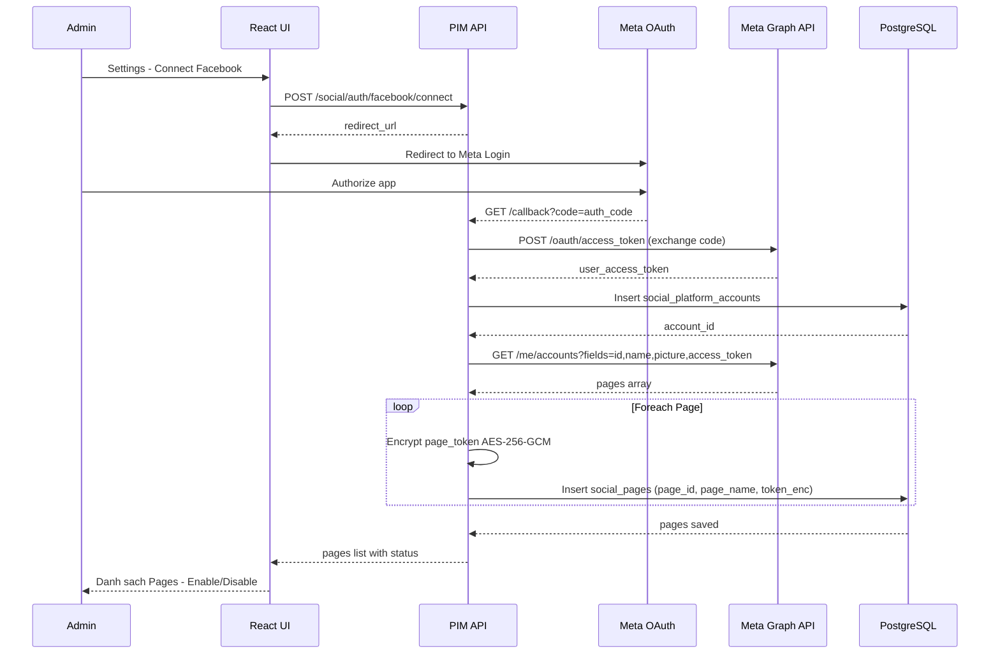

---

### SD-002: Publish Post Now (FR-002 + FR-014 + FR-018 + FR-019)

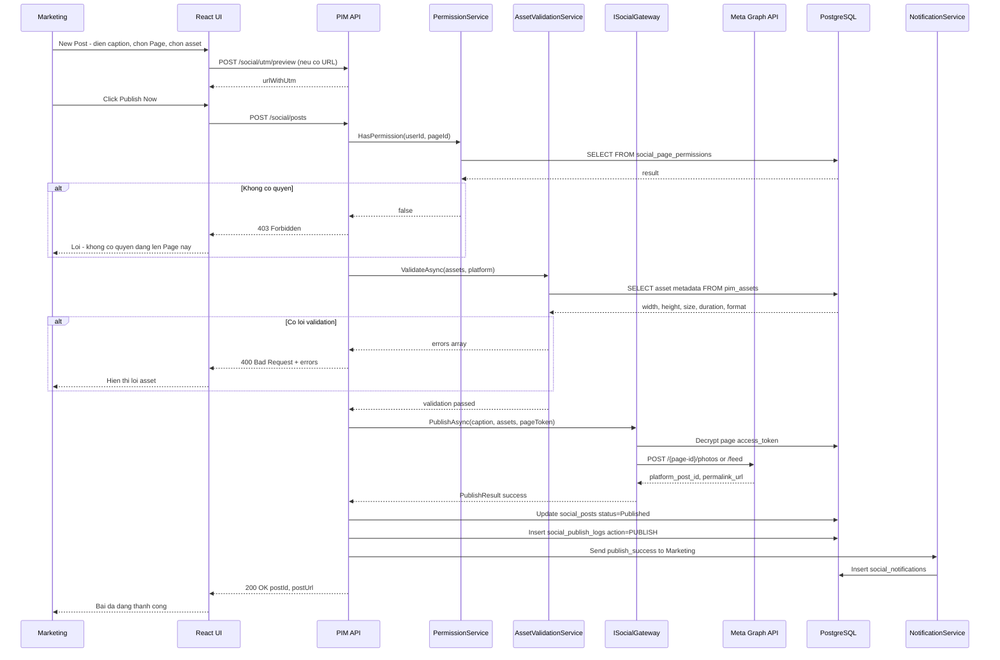

---

### SD-003: Schedule Post + Retry + Dead Letter (FR-003 + FR-015)

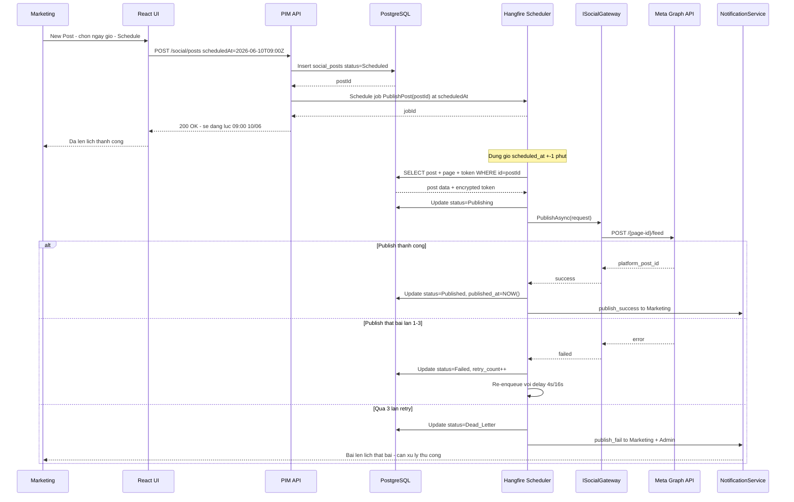

---

### SD-004: Clone / Duplicate Post (FR-008)

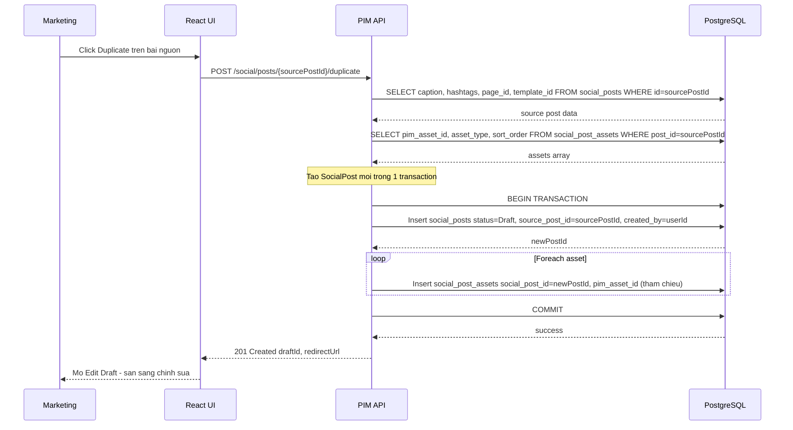

---

### SD-005: Bulk Post Creation (FR-009)

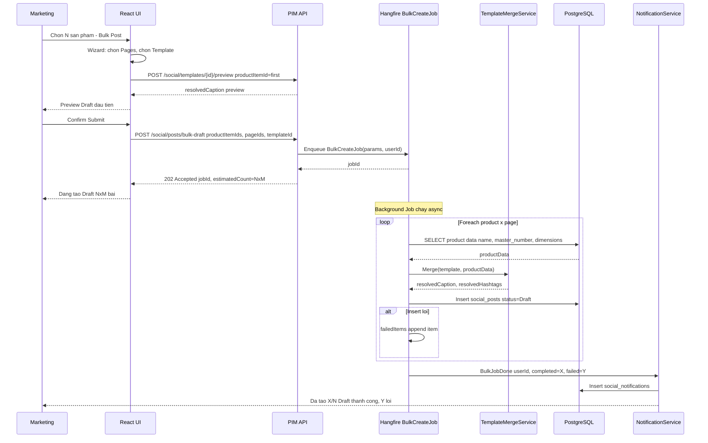

---

### SD-006: Draft Management — Save, Edit, Delete (FR-010)

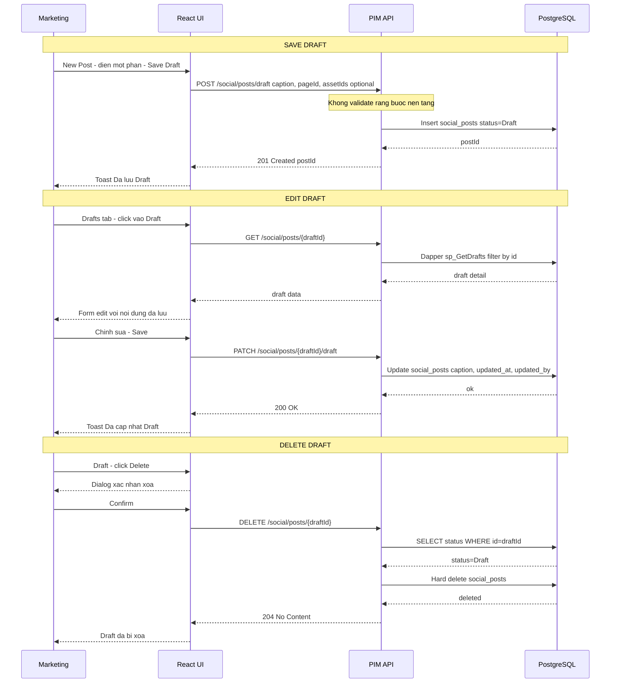

---

### SD-007: Delete Published Post (FR-011)

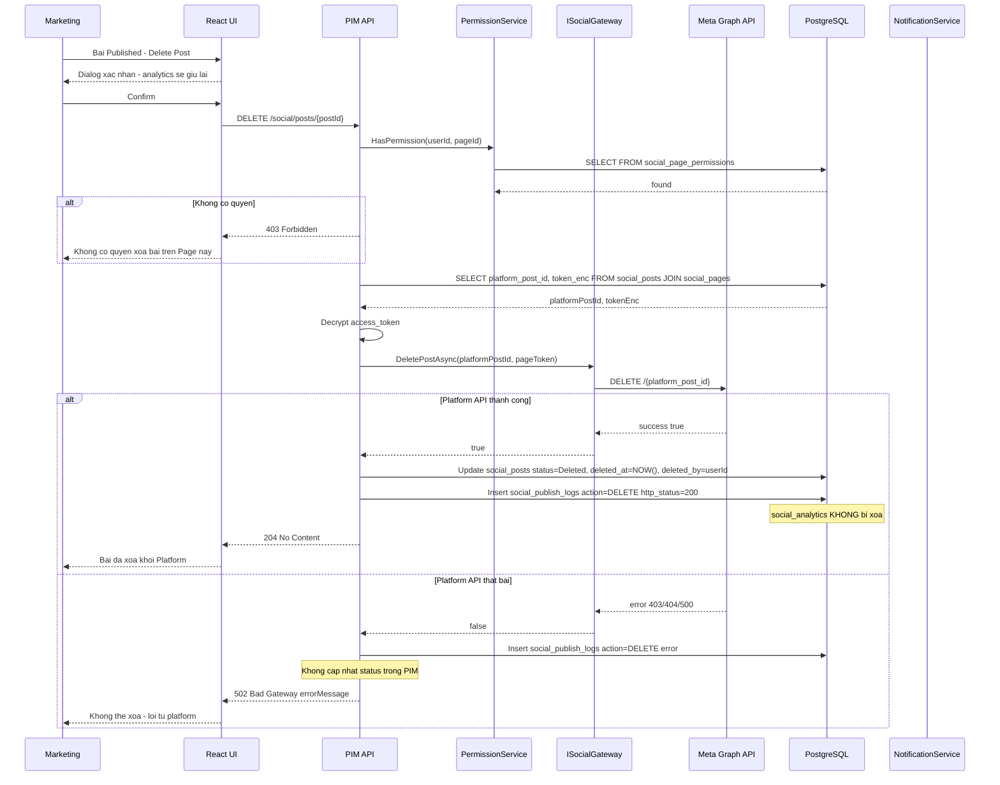

---

### SD-008: Webhook — Bài bị xóa ngoài PIM (FR-007)

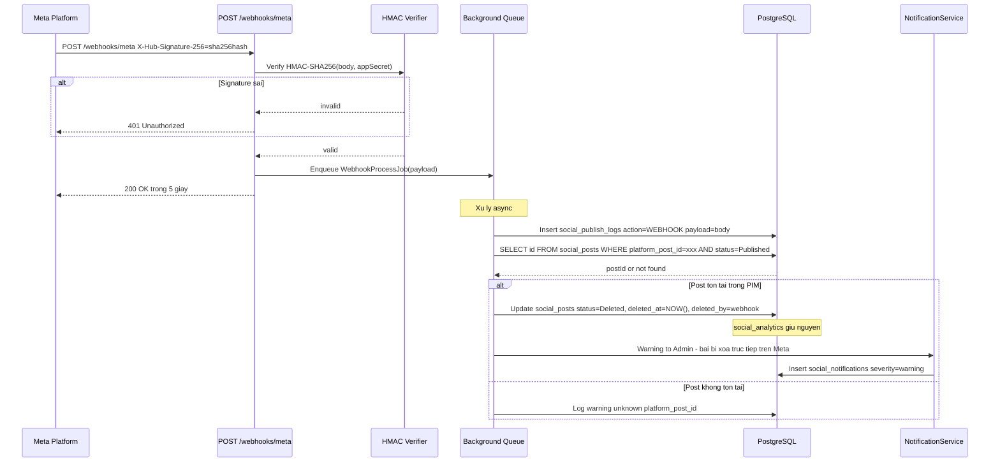

---

### SD-009: Analytics Sync — Recurring Job (FR-005)

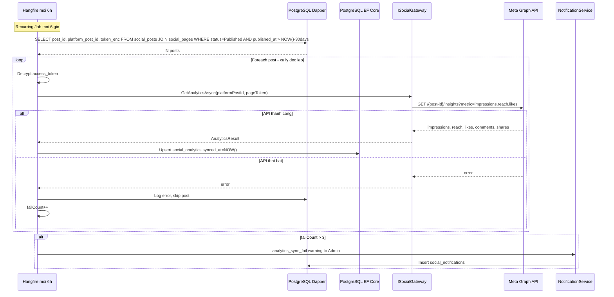

---

### SD-010: Token Refresh (FR-006 + FR-015)

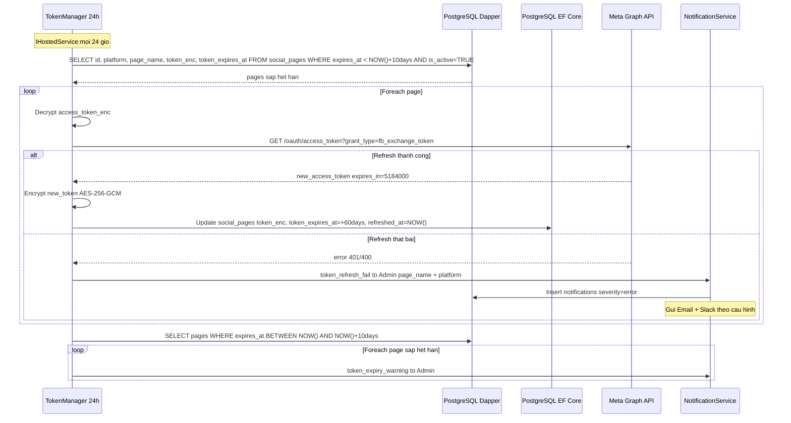

---

### SD-011: Asset Validation (FR-014)

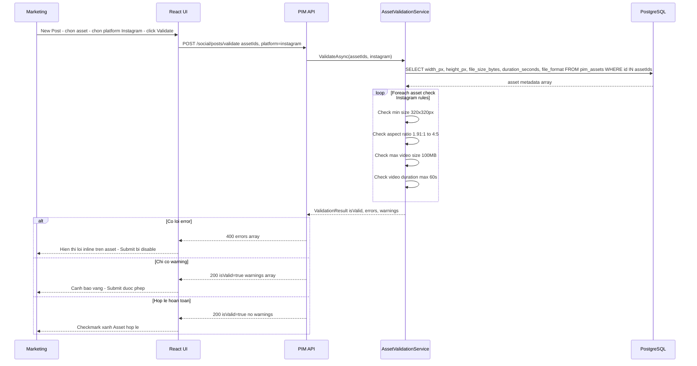

---

### SD-012: Export Analytics (FR-016)

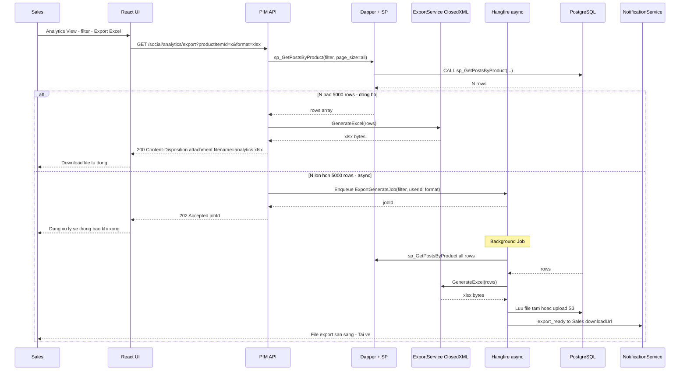

---

### SD-013: Content Calendar — Drag & Drop Reschedule (FR-013)

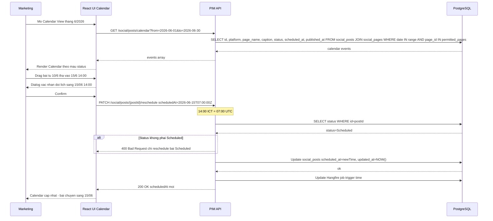

---

### SD-014: Post Template — Apply & Merge (FR-012)

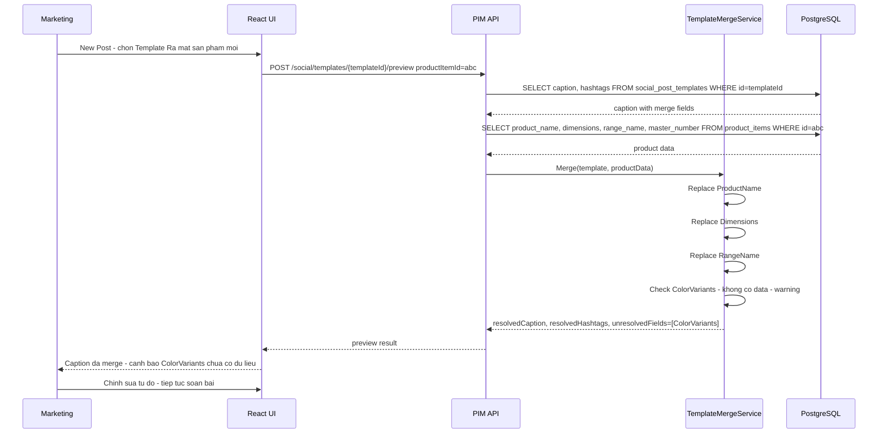

---

### SD-015: Page Permission — Cấp & Kiểm tra quyền (FR-019)

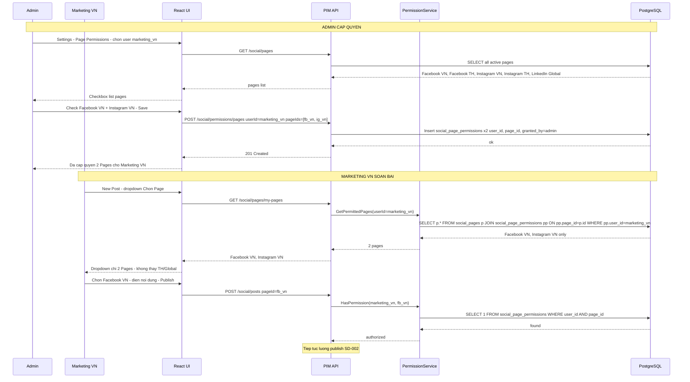

